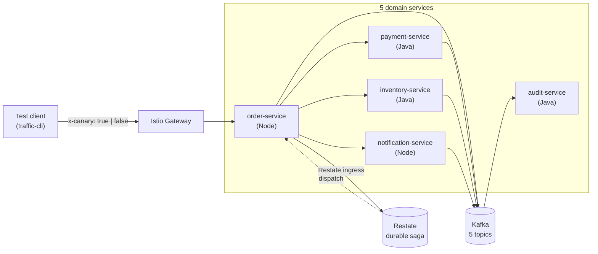

# Canary Release Management

**A working reference architecture for safely rolling out new versions of services across HTTP, Kafka, and Restate — on your laptop.**

---

## What is a "canary release"?

A canary release is when you deploy a new version of a service *alongside* the existing stable version, send a small slice of traffic to it, watch how it behaves, and either promote it or roll it back. The risky new code only sees the canary slice — stable users never get touched.

## What does this project do?

It shows — concretely, end-to-end, on a single developer machine — **how to canary a polyglot, event-driven, durably-orchestrated microservice system without harming stable releases**.

Five services (3 Java + Spring Boot 4, 2 TypeScript + Node) talk to each other over three different "substrates":

| Substrate | What it is | Why canary is hard here |
|---|---|---|
| **HTTP** (via Istio) | Synchronous service-to-service calls | Easiest — request-level header routing |
| **Kafka** (via Strimzi) | Async event streams | Consumers are pull-based; subsets need their own offset cursors |
| **Restate** (durable workflows) | Long-running, exactly-once orchestration | Handlers are registered globally; can't accidentally cross subsets |

A **single HTTP header** (`x-canary: true`) drives canary routing on **all three** substrates. The platform libraries propagate it automatically — application code never reads or writes the header.

## Why does this exist?

Production canary tutorials usually stop at "Istio routes HTTP by header". Real systems are messier — they emit Kafka events, run durable sagas, and span multiple languages. This repo answers the harder question:

> *How do you canary a system where a single request fans out across HTTP, Kafka, and Restate — and still guarantee stable users are never affected?*

It's an executable answer. You clone it, run `make up`, and watch flagged traffic flow through canary subsets at every hop while baseline traffic stays entirely on stable.

---

## High level Architecture



When a request arrives carrying `x-canary: true`:

- **Istio** routes the HTTP hop to the canary subset *if* one is deployed for that service; otherwise falls back to stable.
- **Kafka** consumers in the canary subset use a *different consumer group* than stable — same topic, separate offset cursor.
- **Restate** handlers are registered under variant-isolated service names (`*Stable` / `*Canary`), so a flagged saga can never call into stable handlers.
- **Stable takes over** if canary becomes unhealthy (a presence-watch protocol flips a flag in stable pods within ~1s).

The mechanics live in [docs/canary-mechanics.md](docs/canary-mechanics.md). If you read one doc, read that one.

---

## 🚀 Try it on your laptop

### Prerequisites

Docker, `kind`, `kubectl`, `helm`, `istioctl` 1.29.2, JDK 25, Node 20+, pnpm 9.12.0, `bats`, `jq`. Full list with install commands in [docs/development.md#prerequisites](docs/development.md#prerequisites).

### First 10 minutes

```bash
# 1. Install workspace deps (~30 sec)
git clone <repo-url> && cd canary-release-mgmt
pnpm install

# 2. Verify your toolchain (~2 min, no cluster needed)
make verify                 # ~118 unit tests across Java + Node

# 3. Bring up the substrate (~4 min)
make up                     # kind cluster + Istio + Kafka + Restate
make smoke-infra            # 11 assertions

# 4. Build + deploy services (~3 min)
make build-services && make build-images && make load-images
make deploy-services        # Helm install all 5 + Istio routing
make smoke-services
```

### See a canary in action

```bash
# Baseline — no header. Saga runs through stable everywhere.
node tools/traffic-cli/bin/traffic-cli order

# Deploy a canary for payment-service
make canary-deploy SVC=payment-service TAG=dev
make canary-status SVC=payment-service

# Flagged request — header set. Only payment-service goes canary.
node tools/traffic-cli/bin/traffic-cli order --canary
```

The response includes an `x-served-chain` header showing which subset served each hop. The flagged response should read something like:

```
x-served-chain: order-service=stable, inventory-service=stable,
                payment-service=canary, notification-service=stable
```

### Watch it visually

```bash
make dashboards             # background port-forwards
make dashboards-status
```

| Dashboard | URL | What you'll see |
|---|---|---|
| **Kiali** | http://localhost:20001 | Live service graph — two edges from order-service → payment-service (stable + canary) with the traffic split |
| **Grafana** | http://localhost:3000 | "Canary — Overview / Substrates / Traces" dashboards: lane-active matrix, error rate + p95 by service × lane |
| **Jaeger** | http://localhost:16686 | Trace a flagged request end-to-end. Filter by tag `x-canary=true`. Each span shows `version=stable\|canary` |
| **Prometheus** | http://localhost:9090 | Raw `canary_request_total`, `canary_request_duration_seconds`, `canary_lane_active` metrics |

The full walkthrough — including a traffic-generator loop and a tour of each dashboard — is in [docs/onboarding.md#manual-dashboard-walkthrough](docs/onboarding.md#manual-dashboard-walkthrough).

### Clean up

```bash
make canary-rollback SVC=payment-service
make undeploy-services      # keeps the cluster
make down                   # destroys the kind cluster
```

---

## 📚 Documentation

The docs are layered so you can stop reading at any depth that's enough for your task.

| Doc | Read it when… |
|---|---|
| **[docs/onboarding.md](docs/onboarding.md)** ⭐ | **Start here.** First 30 minutes hands-on + dashboard walkthrough |
| **[docs/canary-mechanics.md](docs/canary-mechanics.md)** ⭐ | You want to understand *how* the header flows and why it's safe |
| [docs/architecture.md](docs/architecture.md) | You want the system map, per-service stack, and substrate versions |
| [docs/development.md](docs/development.md) | You're setting up your local toolchain or running a service in isolation |
| [docs/operations.md](docs/operations.md) | You're bringing up the cluster, running e2e suites, troubleshooting |
| [docs/known_issues.md](docs/known_issues.md) | Something's broken and you want to check whether it's a known one |
| [docs/runbooks/](docs/runbooks/) | A dashboard is showing red — pick the matching runbook |
| [docs/history.md](docs/history.md) | You want the phase-by-phase implementation log of what shipped when |
| [docs/design-decisions.md](docs/design-decisions.md) | You want the *why* — alternatives considered, trade-offs accepted, deferred-phase rationale |

---

## 🗂️ Repo layout

```
canary-release-mgmt/
├── Makefile                  # primary entrypoint — every workflow has a target
├── deploy/                   # kind, Helm chart + values, Istio routing, KafkaTopics
├── platform/
│   ├── lib-java/             # Spring Boot 4 starter — filters, interceptors, watchers
│   ├── lib-node/             # TS package — Express middleware, axios + KafkaJS interceptors
│   └── restate-defs-{java,node}/   # cross-service Restate type contracts
├── services/                 # 5 domain services (3 Java + 2 Node)
│   ├── order-service         # Node — orchestrator entrypoint
│   ├── inventory-service     # Java
│   ├── payment-service       # Java
│   ├── notification-service  # Node
│   └── audit-service         # Java — consumes every *.events topic
├── tools/
│   ├── canary-ctl/           # per-service canary lifecycle CLI
│   └── traffic-cli/          # send a single /api/orders POST with/without x-canary
├── tests/
│   ├── infra/ services/ canary/   # bats smoke tests
│   └── e2e/                       # 13 HTTP + 6 Kafka + 7 Restate + 1 observability scenarios (vitest)
└── docs/                     # everything above
```

**Where do I make a change?**

| Intent | Place |
|---|---|
| Change domain behavior | `services/<svc>/` |
| Change `x-canary` propagation | `platform/lib-{java,node}/` |
| Add/change a Restate contract (`*Stable` / `*Canary` split) | `platform/restate-defs-{java,node}/` |
| Change deployment shape | `deploy/helm/` |
| Change Istio routing | `deploy/routing/` |
| Change canary lifecycle | `tools/canary-ctl/` |
| Change test coverage | `tests/{e2e,infra,services,canary}/` |

---

## 🛠️ Common workflows

| Goal | Command |
|---|---|
| Fresh-laptop setup | `pnpm install && make verify` |
| Bring up the substrate | `make up && make smoke-infra` |
| Build + deploy all services | `make build-services && make build-images && make load-images && make deploy-services` |
| Run all unit tests | `make verify` |
| Run all e2e scenarios | `make e2e` (~20 min, S1–S13 + K1–K6 + R1–R7 + O1) |
| Run the fast inner-loop e2e subset | `make ci-local` (~5 min, S1+S2+S5+S8+S9+S12) |
| Deploy a canary | `make canary-deploy SVC=<svc> TAG=<tag>` |
| Inspect canary state | `make canary-status SVC=<svc>` |
| Roll a canary back | `make canary-rollback SVC=<svc>` |
| Repair canary drift | `make canary-reconcile SVC=<svc>` |
| Open dashboards | `make dashboards` |
| Tear down | `make down` |

`make help` lists every target.

---

## ✅ What's in the box

| Capability | Detail |
|---|---|
| **HTTP canary** | Istio header-based routing, automatic `x-canary` propagation across services, graceful fallback when no canary is deployed |
| **Kafka canary** | Per-subset consumer groups (`<svc>-stable` / `<svc>-canary`), per-message header filter, presence-watch so stable takes over when canary is unhealthy |
| **Restate canary** | β routing with variant-isolated `*Stable` / `*Canary` handler names, durable saga orchestration with explicit compensation |
| **Observability** | Lane-aware metrics (`canary_request_total`, `canary_request_duration_seconds`, `canary_lane_active`), end-to-end OTel tracing across HTTP + Kafka + Restate, three Grafana dashboards, four incident runbooks |
| **Lifecycle tooling** | `canary-ctl` for per-service deploy / rollback / status / reconcile with state-file recovery |
| **Test coverage** | ~118 unit tests + 27 e2e scenarios (S1–S13 HTTP, K1–K6 Kafka, R1–R7 Restate, O1 observability) |

**Not in scope** (intentionally deferred — rationale in [docs/design-decisions.md](docs/design-decisions.md#deferred-phases)):

- Kafka **schema evolution** — schema registry choice, `schemaVersion` field, compatibility policy
- **Percent-split routing + automated promotion** — Argo Rollouts / Flagger, GitHub Actions, OPA policies
- **Production alerting** — Alertmanager, burn-rate SLOs, paging (no on-call audience for a reference repo)

---

## ⚠️ Known issues

Three notable gaps to be aware of:

- **K1 e2e saga timeout** — K1's flagged-saga path hangs past 5 minutes on a real cluster; unit tests still pass. Deferred Phase 2 follow-up.
- **No automatic stable-takeover for Restate** — When canary is unhealthy, flagged Restate calls still hit `*Canary` handlers and surface as HTTP 502/503 (deliberate asymmetry with Phase 2's Kafka graceful fallback).
- **Phase 2.c and Phase 4 are out of scope today** — Schema evolution + percent-split routing intentionally deferred.

Details, mitigations, and an updated list live in [docs/known_issues.md](docs/known_issues.md).

---

## 🔢 Substrate versions

Pinned at the top of [Makefile](Makefile):

- Istio **1.29.2**
- Strimzi **0.45.2** (Kafka via the Strimzi operator)
- Restate **1.6.2** (server) — wire-compatible with Java SDK 2.7.0 + Node SDK 1.14.2
- Spring Boot **4.0.4** / **JDK 25**
- pnpm **9.12.0** / Node **20+**

Don't bump the Restate server pin without testing both SDKs.

---

## 🤝 Contributing

1. Read [docs/development.md](docs/development.md) for environment setup and Spring Boot 4 quirks.
2. Make the change. `make verify` should pass.
3. If you touched the Helm chart, deploy scripts, or the canary lifecycle, run `make smoke-canary` and at least `make ci-local`.
4. If you touched anything in the Kafka path, eyeball:

   ```bash
   kubectl -n kafka exec my-cluster-kafka-0 -- \
     bin/kafka-consumer-groups.sh --bootstrap-server localhost:9092 --list
   ```

   to confirm the expected `<svc>-stable` / `<svc>-canary` groups appear.

---

## License

[MIT](LICENSE) © 2026 Sudhir Yelikar.
