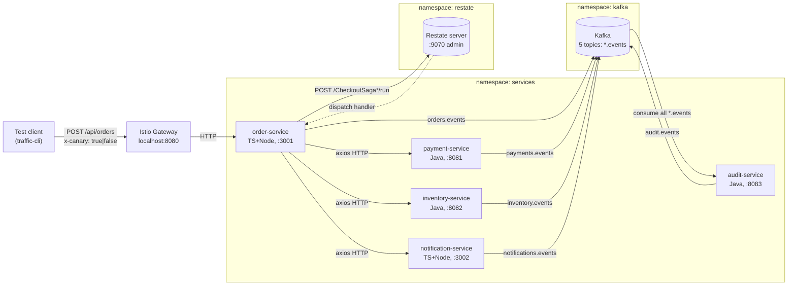
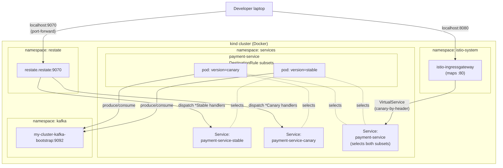

# Architecture

A reference architecture for canary release management across HTTP, Kafka, and
Restate.dev in a polyglot microservice system. Five domain services exchange
work over all three substrates; the platform libraries propagate a single
`x-canary: true` header end-to-end, and Istio's header-based subset routing
plus per-subset Kafka consumer groups keep canary traffic isolated from stable.

## The driving question

> How do you release canary versions of services without harming stable
> releases across HTTP, Kafka, and Restate axes?

This repo answers it concretely, on a developer laptop, with the same
mechanics used in production: Istio header-based routing, per-subset Kafka
consumer groups, and a presence-watch protocol that lets stable take over
when canary becomes unhealthy.

## High-level system

```
                     ┌─────────────────┐
                     │  Istio Gateway  │   (kind: localhost:8080)
                     └────────┬────────┘
                              │  /api/orders
                              ▼
                       order-service  (TS+Node, port 3001)
                              │
        ┌─────────────────────┼─────────────────────┐
        │                     │                     │
        ▼                     ▼                     ▼
  inventory-service     payment-service     notification-service
   (Java, 8082)          (Java, 8081)         (TS+Node, 3002)
        │                     │                     │
        └─────────────┬───────┴─────────────┬───────┘
                      ▼                     ▼
                  Kafka                Kafka producer
              (5 topics, every service produces 1 + consumes ≥1)
                      │
                      ▼
                audit-service (Java, 8083 — consumes every *.events topic)

   Restate (`localhost:9070` admin) — every service registers its handlers
   on startup; saga orchestration lands here in Phase 3.
```

Rendered version (GitHub):



## Substrates (Phase 1.1)

| Component | Version | Where it runs | How to reach |
|---|---|---|---|
| kind cluster | latest | local Docker | `kubectl --context kind-canary-release-mgmt` |
| Istio | 1.29.2 | `istio-system` | Gateway on `localhost:8080` |
| Strimzi / Kafka | 0.45.2 | `kafka` | `my-cluster-kafka-bootstrap.kafka:9092` (in-cluster only) |
| Restate | 1.6.2 | `restate` | admin `localhost:9070`; in-cluster `restate.restate:9070` |
| Prometheus / Grafana / Kiali / Jaeger | Istio addons | `istio-system` | `make dashboards` |

Versions are pinned at the top of [Makefile](../Makefile). Restate
server 1.6.2 is wire-compatible with the Java SDK 2.7.0 and the Node SDK
1.14.2 — do not bump the server pin without testing both SDKs.

## Network topology

How K8s namespaces, per-subset Services, and the two cluster-edge port
mappings line up. `payment-service` is shown with both subsets to
illustrate the pattern — every service has the same shape after a
canary is deployed.



Restate's dispatch path bypasses Istio's DestinationRule subsetting
because Restate's pods sit outside the Istio mesh. The per-subset K8s
Services (`<svc>-stable` / `<svc>-canary`) give Restate variant-isolated
URLs to register against — see [canary-mechanics.md](canary-mechanics.md#restate-path)
for the Phase 3.b β routing details.

## The five services

All deployed to the `services` namespace, behind an Istio sidecar.

| Service | Stack | HTTP | Restate | Kafka producer | Kafka consumer |
|---|---|---|---|---|---|
| order-service | TS + Node | 3001 | 9084 | `orders.events` | `payments.events`, `inventory.events` |
| payment-service | Java + Spring Boot | 8081 | 9081 | `payments.events` | `orders.events` |
| inventory-service | Java + Spring Boot | 8082 | 9082 | `inventory.events` | `orders.events` |
| notification-service | TS + Node | 3002 | 9085 | `notifications.events` | `orders.events`, `payments.events` |
| audit-service | Java + Spring Boot | 8083 | 9083 | `audit.events` | all `*.events` |

The order-service is the entrypoint — POST `/api/orders` runs a 3-step saga
(reserve → charge → notify) over HTTP, and emits `orders.events` so
audit + payment + inventory + notification observe it via Kafka.

## Repo layout

```
canary-release-mgmt/
├── Makefile                  # primary entrypoint — every workflow has a target
├── deploy/
│   ├── kind/                 # cluster bootstrap (Istio, Strimzi, Restate, observability)
│   ├── kafka/topics/         # Strimzi KafkaTopic CRDs (one per *.events topic)
│   ├── helm/
│   │   ├── service-chart/    # ONE chart parameterized for all 5 services
│   │   └── values/           # per-service values + canary-overlay.yaml
│   ├── images/               # Docker build + kind load
│   ├── routing/
│   │   ├── destination-rules # one per service: stable + canary subsets
│   │   ├── virtual-services  # one per service: default-only; canary rule lives here when active
│   │   └── ingress           # Gateway + edge VirtualService (`/api/orders`)
│   └── services/             # deploy.sh / undeploy.sh / pre-warm.sh
├── platform/
│   ├── lib-java/             # Spring Boot 4 starter — filters, interceptors, watchers, health
│   ├── lib-node/             # TS package — middleware, axios + KafkaJS interceptors
│   ├── restate-defs-java/    # cross-service Restate type contracts (DTOs + abstract defs)
│   └── restate-defs-node/    # same, TypeScript
├── services/
│   ├── order-service/        # TS — saga entrypoint
│   ├── payment-service/      # Java
│   ├── inventory-service/    # Java
│   ├── notification-service/ # TS
│   └── audit-service/        # Java
├── tools/
│   ├── canary-ctl/           # Per-service canary lifecycle CLI (Helm + Istio + state)
│   └── traffic-cli/          # Single-request POST to /api/orders, with/without x-canary
├── tests/
│   ├── infra/smoke.bats      # post-`make up` infrastructure smoke
│   ├── services/deploy.bats  # post-`make deploy-services` smoke
│   ├── canary/canary-ctl.bats# canary-ctl integration smoke
│   └── e2e/                  # 13 HTTP scenarios (S1–S13) + 5 Kafka scenarios (K1–K5)
└── docs/
    ├── architecture.md       # this file
    ├── canary-mechanics.md   # how x-canary propagation + presence-watch + per-subset groups work
    ├── development.md        # local setup, build, test, run
    ├── operations.md         # deploy / canary lifecycle / troubleshooting
    ├── history.md            # phase-by-phase implementation log (was the README)
    └── superpowers/          # design specs and implementation plans (one per phase/subphase)
```

## The two platform libraries

Header propagation is the application's responsibility — both libraries
expose the same conceptual primitives, one for each stack:

| Concern | `lib-java` (Spring Boot 4 starter) | `lib-node` (TS / pnpm workspace) |
|---|---|---|
| Inbound: read `x-canary` and pin to context | `XCanaryRequestFilter` → `XCanaryContext` (ThreadLocal) | `xCanaryMiddleware` → `AsyncLocalStorage` |
| Outbound HTTP: stamp header | `XCanaryRestClientInterceptor` (`RestClient`) | `attachXCanaryAxiosInterceptor` (axios) |
| Outbound Kafka: stamp header | `XCanaryKafkaProducerInterceptor` | `stampXCanaryOnProducerRecord` (KafkaJS) |
| Outbound Restate: stamp metadata | `XCanaryRestateClientCustomizer` | `applyXCanaryToRestateOptions` |
| Per-subset consumer group ID | `XCanaryConsumerGroupIdResolver` | `resolveConsumerGroupId` |
| Per-message canary filter | `XCanaryConsumeFilter` | `shouldProcess` |
| Inbound Kafka: pin context | `XCanaryConsumeContext.runWith` | `runWithCanaryFromHeaders` |
| Canary pod presence watch (k8s API) | `XCanaryPresenceWatcher` | `XCanaryPresenceWatcher` |
| Kafka consumer health | `KafkaConsumerHealthIndicator` (Spring Actuator) | `createKafkaHealthState` (Express `/health`) |
| Response stamp `x-served-version` | `XCanaryResponseHeaderFilter` | `xServedVersionMiddleware` |
| Per-hop `x-served-chain` | `XServedChainResponseFilter` + `XServedChainRestClientInterceptor` | `xServedChainMiddleware` + `attachXServedChainAxiosInterceptor` |

The Java starter is wired by `XCanaryAutoConfiguration` (auto-loaded via
`spring.factories` equivalent). The Node side is opt-in: each service calls
the middleware/interceptor builders explicitly. `services/order-service/src/http.ts`
and `services/payment-service/src/main/java/com/canary/payment/` show the
canonical wiring.

## Why Spring Boot 4 needs `@EnableKafka` + a manual factory

Spring Boot 4.0.4's `KafkaAutoConfiguration` regressed from 3.x: it no longer
auto-imports `@EnableKafka` and no longer creates `ConsumerFactory` /
`kafkaListenerContainerFactory` beans. Without them, `@KafkaListener` is
silently a no-op — the bean registers, the listener container never starts,
the consumer group never joins. We provide both beans in
`XCanaryAutoConfiguration` (with `auto.offset.reset=earliest` so brand-new
canary consumer groups pick up the pre-warm trail) and each Java
`*Application` class is annotated with `@EnableKafka`. See
[development.md](development.md#known-spring-boot-4-quirks) for the full
context.

## Where things go next

Phase 1 (HTTP canary), Phase 2.a + 2.b (Kafka canary), Phase 3.a
(Restate substrate completion), and Phase 3.b (Restate canary handler
versioning — β routing) are all merged. Phase 2.c (schema evolution),
Phase 4 (percent-split + Argo Rollouts + CI/CD), and Phase 5
(observability polish) are deferred. See [history.md](history.md) for
a phase-by-phase log of what shipped and why.
