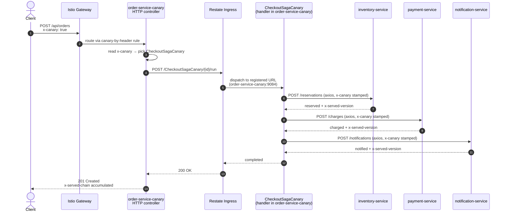
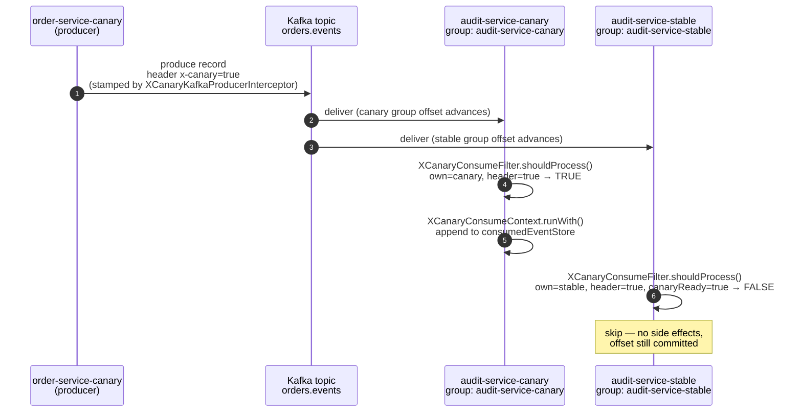
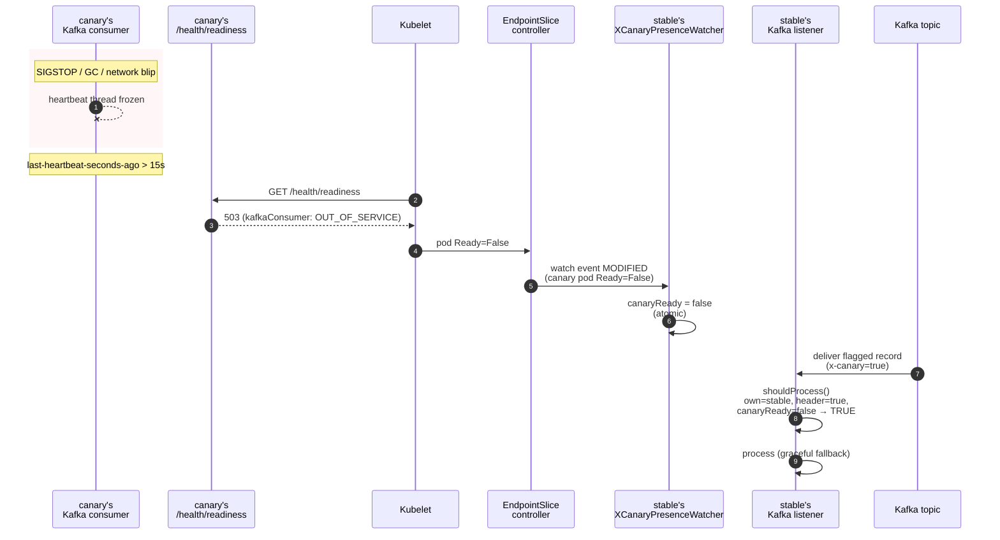
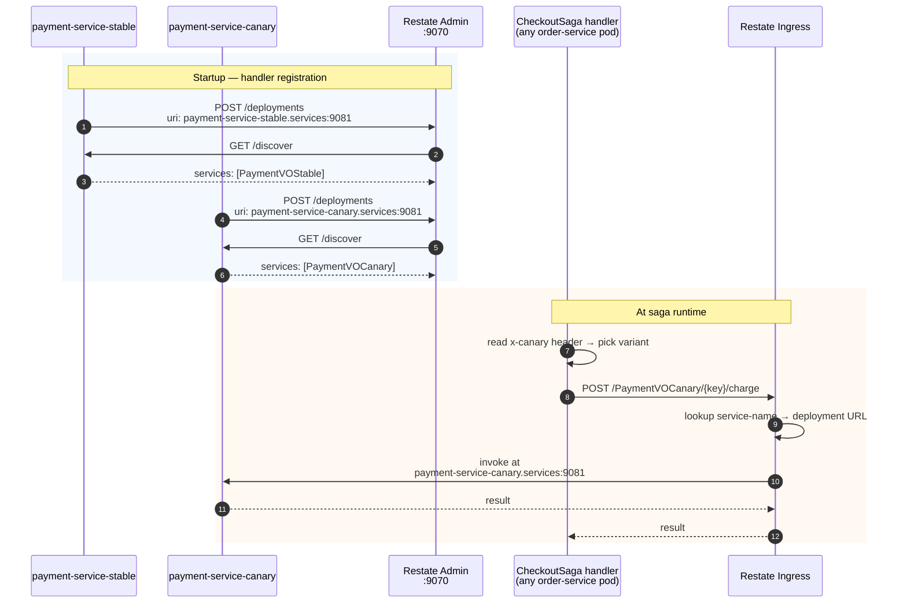

# Canary Mechanics

How `x-canary: true` flows end-to-end across HTTP, Kafka, and Restate, and
how the `canary-ctl` tool orchestrates the lifecycle. Read [architecture.md](architecture.md)
first for the system map.

## The single trigger: `x-canary: true`

Every canary path in this system pivots on one HTTP header.

- **Origin.** Set at the edge by a test client, beta-flag system, or API
  gateway on the initial request. There is **no percent split** — Phase 4.
- **Propagation.** Every service that receives a request carrying
  `x-canary: true` MUST forward the header on every downstream call —
  HTTP, Kafka producer, Restate handler invocation. The platform libraries
  do this automatically; service code never reads or writes the header
  directly.
- **Per-target resolution.** When a request arrives at a service's
  `VirtualService`:
  - `x-canary: true` AND a canary subset has Ready endpoints → route to canary
  - Otherwise → route to stable
- **Independent per-service lifecycle.** Each service can have a canary or
  not, independently. A header-flagged request flowing `A → B → C` hits
  canary-A if deployed (else stable-A), then canary-B if deployed (else
  stable-B), then canary-C if deployed (else stable-C).
- **Graceful fallback.** Header set + no canary deployed for that service →
  fall back to stable, never 503. This is non-negotiable: mid-chain
  services with no canary must not break the chain.
- **Without the header, traffic is always stable.** Even if a healthy
  canary is serving, non-flagged users never see it.

## HTTP path

### 1. Inbound: pin context

The first thing a service does on every request is read `x-canary` and
pin it into request-scoped storage:

- **Java**: `XCanaryRequestFilter` is registered as a servlet filter; it
  reads the header and calls `XCanaryContext.set(true)` before passing
  to the next filter. Storage is a ThreadLocal.
- **Node**: `xCanaryMiddleware` does the same with
  `AsyncLocalStorage`, which propagates across `await` boundaries.

### 2. Outbound: stamp every downstream call

When the service calls another service, the platform library reads the
context and stamps `x-canary: true` on the outbound request:

- **Java RestClient**: `XCanaryRestClientInterceptor` is wired by
  `XCanaryAutoConfiguration` via a `Consumer<RestClient.Builder>` bean;
  every `RestClient.Builder` injected into application code already has
  the interceptor attached.
- **Node axios**: `attachXCanaryAxiosInterceptor(client)` is called once
  per axios instance during HTTP setup. See `services/order-service/src/http.ts:24-29`
  for the canonical wiring (`buildClient` attaches both the canary and
  the chain interceptor).

### 3. Istio routing decides per service

The `VirtualService` for each service has at most two rules. Default state
(no canary deployed) — `default` only:

```yaml
spec:
  hosts: [order-service.services.svc.cluster.local]
  http:
    - name: default
      route:
        - destination: { host: order-service.services.svc.cluster.local, subset: stable }
```

When `canary-ctl` deploys a canary, it patches in a `canary-by-header` rule
ABOVE `default`:

```yaml
spec:
  http:
    - name: canary-by-header
      match: [ { headers: { x-canary: { exact: "true" } } } ]
      route:
        - destination: { host: <svc>, subset: canary }
    - name: default
      route:
        - destination: { host: <svc>, subset: stable }
```

The exact patch JSON is built in
[tools/canary-ctl/src/kubectl.ts:3-19](../tools/canary-ctl/src/kubectl.ts).
The `DestinationRule` is static — both subsets exist whether or not a canary
is deployed; the rule selects pods by the `version: stable` / `version: canary`
label set on each Helm release.

### 4. Response stamping

For testing and debugging, every service stamps its own subset on the
response:

- `x-served-version: stable` or `canary` — set by `XCanaryResponseHeaderFilter`
  (Java) / `xServedVersionMiddleware` (Node).
- `x-served-chain: order-service=canary, payment-service=stable, ...` — each
  service appends its own token AND propagates the downstream chain by
  reading the response header from RestClient/axios calls. Test code uses
  this to verify multi-hop routing without Jaeger.

### 5. Full request sequence (Restate-orchestrated, Phase 3.a)

Since Phase 3.a, the `/api/orders` saga is durable: the order-service
HTTP controller submits to the Restate Ingress, and the
`CheckoutSaga{Stable,Canary}` handler (running in the order-service pod
itself) drives the inventory → payment → notification calls.



Without the header, the controller picks `CheckoutSagaStable` and the
exact same flow runs through the stable subsets at each hop.

## Kafka path

### Per-subset consumer groups

Stable and canary pods consume the SAME topics but via DIFFERENT consumer
groups. The group ID is resolved at startup:

- **Java**: `@KafkaListener(groupId = "#{xCanaryConsumerGroupIdResolver.resolve('payment-service')}")`
  → resolves to `payment-service-stable` or `payment-service-canary` based
  on the `canary.version` / `VERSION` env var.
- **Node**: `kafka.consumer({ groupId: resolveConsumerGroupId("order-service") })`
  → same logic.

This guarantees Kafka's group rebalance never moves partitions between
stable and canary, and gives each subset its own offset cursor.

### Per-message filter

A consumer group might receive both flagged and unflagged messages
(producers always write to the same topic). The filter's job is to make
each subset process only the messages it should:

| Subset | Header | Decision |
|---|---|---|
| stable | absent | process |
| stable | `x-canary: true` AND canary is Ready | skip |
| stable | `x-canary: true` AND canary is NOT Ready | process (graceful fallback) |
| canary | `x-canary: true` | process |
| canary | absent | skip |

In code:

- **Java**: `XCanaryConsumeFilter.shouldProcess(record.headers())`
  ([platform/lib-java/.../XCanaryConsumeFilter.java](../platform/lib-java/src/main/java/com/canary/platform/lib/XCanaryConsumeFilter.java))
- **Node**: `shouldProcess(headers, ownVersion, isCanaryReady)`
  ([platform/lib-node/src/x-canary-consume-filter.ts](../platform/lib-node/src/x-canary-consume-filter.ts))

The hot-path filter is an O(1) atomic flag read — no per-message K8s API
calls.

### Context pinning on consume

When the filter accepts a message, the listener wraps the handler in an
`XCanaryConsumeContext` (Java) / `runWithCanaryFromHeaders` (Node) frame.
Any HTTP / Kafka / Restate calls the handler makes inherit `x-canary` —
exactly the same propagation pattern as the inbound HTTP filter.

```java
// services/payment-service/src/main/java/com/canary/payment/kafka/PaymentKafkaListener.java
@KafkaListener(topics = "orders.events",
               groupId = "#{xCanaryConsumerGroupIdResolver.resolve('payment-service')}")
public void onMessage(ConsumerRecord<String, String> record) {
    if (!filter.shouldProcess(record.headers())) return;
    XCanaryConsumeContext.runWith(record.headers(), () -> {
        store.record(...);
    });
}
```

Readiness is fed by consumer-group lifecycle events, not by message
receipt. Node side, the same wiring looks like:

```ts
// kafkajs
c.on(c.events.GROUP_JOIN, () => health.markAssigned());
c.on(c.events.HEARTBEAT,  () => health.recordHeartbeat());
c.on(c.events.REBALANCING, () => health.markRevoked());
c.on(c.events.DISCONNECT, () => health.markRevoked());
```

Java reads the kafka-clients metric `last-heartbeat-seconds-ago` driven
by a `ConsumerAwareRebalanceListener` (substituted for the spring-kafka
4.0.4-missing `ConsumerPartitionsAssignedEvent` /
`ConsumerPartitionsRevokedEvent`).

### Sequence: K1 — flagged event reaches canary, skipped by stable

This is the K1 e2e scenario. Both subsets receive the record (different
consumer groups, same topic); the per-message filter decides who acts.



K2 (unflagged event) is the mirror image: stable processes, canary
skips. K3 (flagged event, no canary deployed) is the graceful fallback
— stable's filter returns TRUE because `canaryReady=false`.

## Presence watching: how stable knows when canary is unavailable

The graceful-fallback rule "stable processes flagged messages when canary
is NOT Ready" needs a reliable signal of canary health.

`XCanaryPresenceWatcher` (Java + Node, identical contract) opens a
**long-lived k8s `watch`** on Pods matching `app=<svc>,version=canary` in
its own namespace. The K8s API server pushes events as canary pods deploy,
become Ready, lose Ready, or terminate — typical detection lag is <1s.

The watcher maintains a single atomic `canaryReady` flag, updated push-style
by watch events. The consume-filter reads this flag on every message.

### How a canary failure becomes a stable takeover (K5 scenario)

1. Canary pod's Kafka consumer wedges (network blip, GC pause, SIGSTOP, etc.).
2. The canary's heartbeat thread is frozen by SIGSTOP, so
   `last-heartbeat-seconds-ago` (Java) / `consumer.events.HEARTBEAT`
   (Node) goes stale beyond `canary.kafka-heartbeat-stale-ms` (default 15s).
3. The `KafkaConsumerHealthIndicator` reports `OUT_OF_SERVICE`.
4. **Canary's** readiness probe fails (canary's `/health` or actuator
   `kafkaConsumer` is in the readiness group).
5. Kubelet drops the canary pod from the EndpointSlice; pod transitions to
   `Ready=False`.
6. Stable pods' `XCanaryPresenceWatcher` receives the watch event; flag
   flips `canaryReady = false`.
7. Stable processes the next flagged message that arrives → graceful fallback.

As a sequence diagram:



### Why stable's `/health` is NOT Kafka-gated

This was a hard-won lesson during cluster verification of Phase 2.b. The
canary readiness gate exists to break the K5 loop. We keep the gate
canary-only because stable doesn't need a Kafka takeover signal — only
canary does.

Stable uses `readinessState` only; canary's `canary-overlay.yaml`
adds `MANAGEMENT_ENDPOINT_HEALTH_GROUP_READINESS_INCLUDE: "readinessState,kafkaConsumer"`
to opt canary alone into the Kafka gate. Same split lives in Node `/health`
(`services/order-service/src/http.ts:35-46`).

Cold-start is no longer a problem — `make pre-warm` is documented as an
optional e2e helper in [operations.md](operations.md#cold-cluster-pre-warm-optional).

## RBAC: presence watcher needs `pods/watch`

Each service's ServiceAccount gets a Role + RoleBinding granting `get,list,watch`
on Pods in its own namespace. Defined in
`deploy/helm/service-chart/templates/role.yaml`, conditional on
`.Values.canaryWatch.enabled` (default `true`). Smoke-check after deploy:

```bash
kubectl auth can-i watch pods -n services \
  --as=system:serviceaccount:services:payment-service
# expected: yes
```

## Restate path

Restate provides the saga's durability (Phase 3.a) and the
variant-isolated handler dispatch (Phase 3.b β routing). The two
shipping invariants:

1. **Distinct service names per subset.** Stable pods register
   `CheckoutSagaStable`, `ReservationWorkflowStable`,
   `PaymentVOStable`, `NotificationServiceStable`. Canary pods
   register the same handlers under `*Canary` names. Per-subset K8s
   Services (`<svc>-stable` / `<svc>-canary`) give Restate
   variant-isolated URLs to register against, since Restate's pods sit
   outside the Istio mesh and cannot use DestinationRule subsetting.
2. **Variant chosen at invocation time by header.** The order-service
   HTTP controller reads `x-canary` on the incoming request and
   POSTs to either `/CheckoutSagaStable/{id}/run` or
   `/CheckoutSagaCanary/{id}/run`. Saga handlers do the same when
   calling other Restate services.

### Sequence: registration + variant dispatch



Variant isolation is enforced by three independent layers
(registration under distinct names, in-saga client construction
picking `*Stable` vs `*Canary`, K8s endpoint selection via per-subset
Services). A `*Canary` invocation **cannot** reach a stable handler —
this is the load-bearing β invariant.

### Asymmetry: no automatic stable-takes-over fallback

Phase 2's Kafka path implements graceful fallback ("if `x-canary=true`
AND canary pod NOT deployed, stable processes") via the
`XCanaryPresenceWatcher` + per-message filter. **Phase 3.b does not
replicate this.** The order-service HTTP controller routes by header
alone; when canary is unhealthy, flagged requests still POST to
`/CheckoutSagaCanary/...` and Restate either 404s or retries the dead
URL until an operator intervenes. Failure surfaces as HTTP 502/503 —
observable to the client (unlike Phase 2's Kafka black-hole risk that
made fallback essential).

For the full operational runbook (graceful vs emergency canary
teardown, Restate CLI commands), see
[operations.md — Canary teardown runbook (β routing)](operations.md#canary-teardown-runbook-β-routing).
For the *why* behind choosing β over α, see
[design-decisions.md — Restate canary routing](design-decisions.md#restate-canary-routing-phase-3b).

## The `canary-ctl` lifecycle

`canary-ctl` is the per-service orchestrator: Helm release + VirtualService
patch + state file, all in lockstep. It is the ONLY supported way to deploy
a canary — never `helm install` it manually, or the VirtualService rule and
the state file will drift out of sync.

### State file

`~/.canary-ctl/<service>.json` (override with `--state-dir`). Schema
([tools/canary-ctl/src/state.ts](../tools/canary-ctl/src/state.ts)):

```json
{
  "service": "payment-service",
  "phase": "active",            // deploying | deployment-ready | active | rolling-back
  "tag": "dev-2026-05-10",
  "deployedAt": "2026-05-10T10:00:00Z"
}
```

### `deploy-canary <svc> <tag>`

1. Write state `phase: deploying`.
2. `helm upgrade --install <svc>-canary deploy/helm/service-chart -f
   deploy/helm/values/<svc>.yaml -f deploy/helm/values/canary-overlay.yaml
   --set image.tag=<tag>`. Wait for rollout.
3. On rollout failure → auto-rollback (uninstall, ensure VS rule is
   default-only, clear state) and re-throw the error.
4. Write state `phase: deployment-ready`.
5. Patch the VirtualService — apply `canary-by-header` + `default` rules.
6. Write state `phase: active`.

### `rollback <svc>`

1. Write state `phase: rolling-back`.
2. Patch the VirtualService back to default-only (so no new flagged
   traffic reaches canary).
3. Sleep `--grace-seconds` (default 10) to let in-flight requests drain.
4. `helm uninstall <svc>-canary`.
5. Delete state file.

Each step is idempotent — running `rollback` against a clean cluster is a
no-op.

### `status <svc>` and `reconcile <svc>`

`status` prints the cross-product of (state file × cluster state):

- state file present? what phase + tag?
- helm release present?
- VirtualService rule names — does `canary-by-header` exist?
- drift list — entries are emitted whenever (state, helm, VS) disagree.

Exit code 2 if drift is non-empty. Add `--json` for machine output.

`reconcile` interprets the same cross-product and brings everything to a
consistent state:

- State says `deploying` but no Helm release → finish rollback (clear state).
- Helm release exists but no VS rule → finish deploy (apply rule, set state to active).
- VS rule exists but no Helm release → finish rollback (remove rule).
- All three present and consistent → no-op.

`reconcile --adopt` flips the policy: orphan Helm releases get adopted into
state instead of rolled back. Useful for migrating from manual experiments.

### Diagram

```
   make canary-deploy SVC=payment-service TAG=dev
            │
            ▼
   ┌───────────────────────┐
   │ 1. write state:       │
   │    phase=deploying    │
   └───────────┬───────────┘
               │
               ▼
   ┌───────────────────────┐
   │ 2. helm upgrade       │
   │    --install <svc>-canary
   │    -f canary-overlay  │  ── on failure ──▶ auto-rollback (1.4.b)
   │    --wait             │
   └───────────┬───────────┘
               │ rollout OK
               ▼
   ┌───────────────────────┐
   │ 3. write state:       │
   │    phase=deployment-ready
   └───────────┬───────────┘
               │
               ▼
   ┌───────────────────────┐
   │ 4. patch VirtualService:
   │    insert canary-by-header
   │    rule above default │
   └───────────┬───────────┘
               │
               ▼
   ┌───────────────────────┐
   │ 5. write state:       │
   │    phase=active       │
   └───────────────────────┘
```

## End-to-end example: a flagged order

```
$ node tools/traffic-cli/bin/traffic-cli order --canary

POST localhost:8080/api/orders   x-canary: true
        │
        ▼
Istio Gateway → edge VirtualService → order-service VirtualService
        │  canary-by-header rule matches → subset=canary
        ▼
order-service-canary (TS)
  ├─ POST inventory-service /reservations    (axios, x-canary stamped)
  │       └─ inventory-service VirtualService
  │             canary-by-header → subset=canary (if deployed)
  │             else default → subset=stable
  ├─ POST payment-service /charges
  ├─ POST notification-service /notifications
  └─ Kafka producer: orders.events { x-canary: "true" }
              │
              ▼
       audit-service (consumer group resolution):
         canary group:  audit-service-canary  → consumes (filter accepts: header=true, ownVersion=canary)
         stable group:  audit-service-stable  → skips (header=true, ownVersion=stable, canaryReady=true)

Response: x-served-version: canary
          x-served-chain: order-service=canary,inventory-service=canary,...
```
