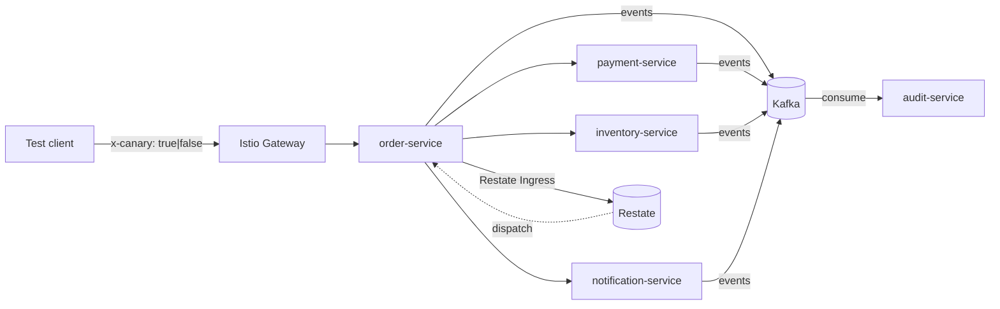

# Onboarding — canary-release-mgmt

If you've never touched this repo, start here. This doc gets you to
a working canary in 30 minutes, then shows you how to *see* it
working through the dashboards. Deep dives are linked at the bottom.

## What this is (60 seconds)

A reference architecture for canary release management across **three
substrates** — HTTP, Kafka, and Restate.dev — in a polyglot
microservice system. Five domain services (3 Java + Spring Boot 4,
2 TypeScript + Node) deploy to a local **kind** cluster behind Istio,
exchange events through Kafka, and orchestrate a durable saga through
Restate. A single `x-canary: true` HTTP header drives canary routing
on every substrate.

The interesting bit is **how** that works: per-subset Istio routing
for HTTP, per-subset Kafka consumer groups, a presence-watch protocol
so stable can take over when canary becomes unhealthy, and
variant-isolated Restate handler names (`*Stable` / `*Canary`) so
durable workflows can't accidentally cross subsets.

Read [architecture.md](architecture.md) for the long version of the
system map and [canary-mechanics.md](canary-mechanics.md) for what the
header actually does.

## Mental model — four invariants



The four invariants you need in your head:

1. **The header propagates automatically.** Every service that
   receives `x-canary: true` forwards it on every downstream HTTP,
   Kafka, and Restate call. Done by `platform/lib-java` and
   `platform/lib-node` — service code never reads or writes the header
   directly.
2. **Per-subset Kafka consumer groups.** Stable and canary consume
   the same topics via *different* consumer groups
   (`<svc>-stable` / `<svc>-canary`). Group rebalances never move
   partitions between subsets, and each subset has its own offset
   cursor.
3. **Presence-watch fallback.** Stable processes flagged messages
   only when canary is unhealthy. A long-lived k8s pod-watch flips
   the `canaryReady` flag in stable pods; the per-message Kafka
   filter reads it on every record. Detection lag is typically <1s.
4. **Durable orchestration with variant-isolated handlers.** The
   `/api/orders` saga is orchestrated by Restate (Phase 3.a), not by
   ad-hoc axios calls. Each variant registers under a distinct
   service name (`CheckoutSagaStable` / `CheckoutSagaCanary`); the
   order-service controller picks which one to invoke based on the
   header (Phase 3.b β routing). A `*Canary` invocation cannot reach
   a stable handler.

## Repo layout in 90 seconds

```
canary-release-mgmt/
├── Makefile                # primary entrypoint — every workflow is a target
├── deploy/                 # kind / Istio / Helm / KafkaTopics / routing
│   ├── helm/service-chart  # ONE chart parameterized for all 5 services
│   ├── helm/values         # per-service values + canary-overlay.yaml
│   └── routing             # DestinationRule + VirtualService per service + Gateway
├── platform/
│   ├── lib-java            # Spring Boot 4 starter (header filters, interceptors,
│   │                       #   watchers, health) — change here for SB4 services
│   ├── lib-node            # TS package (Express middleware + axios/KafkaJS
│   │                       #   interceptors) — change here for Node services
│   └── restate-defs-{java,node}   # cross-service Restate contracts
│                                  # (*Stable / *Canary split lives here)
├── services/               # 5 domain services, see table below
├── tools/
│   ├── canary-ctl          # per-service canary lifecycle CLI (Helm + Istio + state)
│   └── traffic-cli         # single-request POST to /api/orders (with/without header)
├── tests/
│   ├── infra/   services/  # bats smoke tests
│   ├── canary/             # canary-ctl bats smoke
│   └── e2e/                # 13 HTTP + 5 Kafka + 7 Restate scenarios (vitest)
└── docs/                   # this directory
```

Service-stack quick reference:

| Service | Stack | HTTP | Restate | Kafka producer | Kafka consumer |
|---|---|---|---|---|---|
| order-service | TS + Node | 3001 | 9084 | `orders.events` | `payments.events`, `inventory.events` |
| payment-service | Java + Spring Boot | 8081 | 9081 | `payments.events` | `orders.events` |
| inventory-service | Java + Spring Boot | 8082 | 9082 | `inventory.events` | `orders.events` |
| notification-service | TS + Node | 3002 | 9085 | `notifications.events` | `orders.events`, `payments.events` |
| audit-service | Java + Spring Boot | 8083 | 9083 | `audit.events` | all `*.events` |

Pointers by intent:

- Change domain behavior? → `services/<svc>/`
- Change header propagation? → `platform/lib-{java,node}/`
- Change a Restate contract or add a `*Stable`/`*Canary` split? → `platform/restate-defs-{java,node}/`
- Change deployment shape? → `deploy/helm/`
- Change Istio routing? → `deploy/routing/`
- Change canary lifecycle? → `tools/canary-ctl/`
- Change test coverage? → `tests/{e2e,infra,services,canary}/`

## First 30 minutes

Prereqs: Docker, kind, kubectl, helm, istioctl 1.29.2, JDK 25, Node 20+,
pnpm 9.12.0, bats, jq. Full list in
[development.md](development.md#prerequisites).

```bash
# 1. Clone + workspace deps (~30s)
git clone <your-remote> canary-release-mgmt
cd canary-release-mgmt
pnpm install
```
*What just happened:* pnpm linked the workspace packages
(`platform/lib-node`, `services/*-service`, `tools/*-cli`,
`tests/e2e`) so imports resolve.

```bash
# 2. Verify your toolchain (~2 min, no cluster)
make verify
```
*What just happened:* Java unit tests (~80) and Node unit tests
(~80) all pass. If this fails, your toolchain isn't set up — fix
that before going further.

```bash
# 3. Bring up the substrate (~4 min)
make up
make smoke-infra
```
*What just happened:* `kind create cluster` + Istio 1.29.2 + Strimzi
0.45.2 + Restate 1.6.2 + observability addons + 11 smoke assertions
verifying each piece is reachable.

```bash
# 4. Build + deploy services (~3 min)
make build-services
make build-images
make load-images
make deploy-services
make smoke-services
```
*What just happened:* Java bootJars + Node `dist/` built; 5 Docker
images built and loaded into kind; Helm installs of all 5 services;
KafkaTopics created; Istio Gateway + per-service DestinationRule +
VirtualService applied. Smoke confirms all 5 are running stable and
the gateway answers `POST /api/orders`.

```bash
# 5. Send your first order (stable, baseline)
node tools/traffic-cli/bin/traffic-cli order
```
*What just happened:* `POST /api/orders` (no header). Saga runs
through stable subsets at every hop. Response includes
`x-served-version: stable` and `x-served-chain` listing every
service touched.

```bash
# 6. Deploy a canary on one service
make canary-deploy SVC=payment-service TAG=dev
make canary-status SVC=payment-service
```
*What just happened:* `canary-ctl` wrote a state file
(`~/.canary-ctl/payment-service.json`), Helm-installed
`payment-service-canary`, waited for rollout, and patched the
VirtualService to add a `canary-by-header` rule above the default
rule. Status should show `phase: active`, helm release present, VS
rules `[canary-by-header, default]`, drift `(none)`.

```bash
# 7. Send a flagged order
node tools/traffic-cli/bin/traffic-cli order --canary
```
*What just happened:* `POST /api/orders` with `x-canary: true`.
Istio's `canary-by-header` rule routed to `order-service-stable`
(no canary deployed there), which read the header, picked
`CheckoutSagaStable` for orchestration, and called the 3 downstream
services. Payment's `canary-by-header` rule routed *that* hop to
`payment-service-canary`. Response shows
`x-served-chain: order-service=stable, inventory-service=stable,
payment-service=canary, notification-service=stable`.

> **β dispatch detail.** The handler variant is picked by the pod
> *receiving* the request. Since order-service has no canary
> deployed, the stable pod handles this request and picks
> `CheckoutSagaStable`. If order-service itself had a canary, the
> canary pod would handle flagged requests and pick
> `CheckoutSagaCanary`.

```bash
# 8. Now open the dashboards (next section)
```

When you're done:

```bash
make canary-rollback SVC=payment-service
make undeploy-services    # keep cluster, remove services
make down                 # destroy the kind cluster
```

## Manual dashboard walkthrough

Worked example: canary on `payment-service` is deployed and flagged
traffic is flowing (steps 6 + 7 above). This is what each dashboard
shows you.

### 5.1 Open the dashboards

```bash
make dashboards         # background port-forwards
make dashboards-status  # verify all four are up
```

| Dashboard | URL |
|---|---|
| Kiali | http://localhost:20001 |
| Grafana | http://localhost:3000 |
| Prometheus | http://localhost:9090 |
| Jaeger | http://localhost:16686 |

Generate continuous traffic in another shell while you click around:

```bash
# 30 baseline + 30 flagged orders, interleaved
for i in {1..30}; do
  node tools/traffic-cli/bin/traffic-cli order
  node tools/traffic-cli/bin/traffic-cli order --canary
  sleep 1
done
```

### 5.2 Kiali — see the traffic split visually

1. Navigate **Graph** → Namespace `services` → Display **Versioned
   app graph**.
2. Look at `order-service` → `payment-service`. Two edges should
   appear, one to `version=stable`, one to `version=canary`.
3. With the traffic generator running, you should see roughly 50/50
   request rate on the two edges (baseline = stable, flagged =
   canary).
4. **Smoke check**: zero traffic on the canary edge from baseline
   requests. If the canary edge gets unflagged traffic, header
   propagation is broken somewhere — start by checking the response
   `x-served-chain` and `kubectl logs deploy/payment-service-canary`.

### 5.3 Jaeger — trace a flagged request end-to-end

1. **Service**: `order-service.services`.
2. **Tags**: `x-canary=true`.
3. Click the latest trace. Expand the span tree:
   - root span on `order-service`
   - child spans for `Restate Ingress`,
     `axios → inventory-service`, `axios → payment-service`,
     `axios → notification-service`
   - each span shows `x-served-version=stable|canary` as a process
     tag
4. The payment-service span should show `version=canary`; the other
   three should show `version=stable` (since only payment has a
   canary deployed).

This is the fastest way to confirm multi-hop routing is correct
without reading logs.

### 5.4 Grafana — per-version metrics

1. **Dashboards** → "Istio Workload Dashboard".
2. Workload filter `payment-service-stable`: shows baseline-request
   rate, p99, error rate.
3. Switch the filter to `payment-service-canary`: shows
   flagged-request rate, p99, error rate.
4. Side-by-side comparison is what the **S7** e2e scenario asserts —
   stable's p99 must stay within 1.5× baseline during canary deploy.
   This is the dashboard where you'd see an S7 regression.

### 5.5 Prometheus — one canned query

```promql
sum(rate(istio_requests_total{destination_workload=~"payment-service.*"}[1m]))
  by (destination_workload)
```

Two series, one per subset. If you graph this over 5 minutes during
mixed traffic, you should see roughly equal RPS for stable and
canary — the same picture Kiali shows, just as raw metrics.

### 5.6 Restate admin — inspect handler registration (Phase 3.a / 3.b)

Restate doesn't ship a dashboard in this repo. Use the admin HTTP
API directly:

```bash
# All registered deployments + their service names
curl -s http://localhost:9070/deployments | \
  jq '.deployments[] | {id, uri: .uri, services: [.services[].name]}'

# Expected per stable/canary pair (one of each per service that has a canary):
#   stable pod:  CheckoutSagaStable, ReservationWorkflowStable,
#                PaymentVOStable, NotificationServiceStable
#   canary pod:  CheckoutSagaCanary, ReservationWorkflowCanary,
#                PaymentVOCanary, NotificationServiceCanary
```

```bash
# List active invocations (requires the `restate` CLI, installed with the server)
restate --address http://localhost:9070 invocations list
```

This is the only way to see Phase 3.b's β routing working — distinct
service names per subset (`*Stable` / `*Canary`) is the load-bearing
invariant. If both stable and canary register the *same* service
name, β is broken and you'll see racing dispatches.

### 5.7 Cleanup

```bash
make canary-rollback SVC=payment-service
```

Watch Kiali — the canary edge from `order-service` → `payment-service`
disappears within a few seconds (Istio control-plane push + Kiali
refresh). The canary's consumer groups in Kafka linger until
`__consumer_offsets` expires them; that's expected and harmless.

```bash
make dashboards-stop    # close port-forwards
make down               # destroy the cluster (optional)
```

## Where to go next

| If you want to… | Read |
|---|---|
| Understand the system map + per-service stack | [architecture.md](architecture.md) |
| Understand `x-canary` propagation in depth | [canary-mechanics.md](canary-mechanics.md) |
| Set up your local toolchain / Spring Boot 4 quirks | [development.md](development.md) |
| Deploy, troubleshoot, run e2e scenarios | [operations.md](operations.md) |
| See what shipped in each phase | [history.md](history.md) |
| Understand *why* each architectural choice was made | [design-decisions.md](design-decisions.md) |

When you're ready to contribute, [the README](../README.md#contributing)
has the conventional flow (it's short — basically: change → `make verify`
→ if you touched the cluster path, `make smoke-canary` + `make ci-local`).

## Runbooks

When the canary observability dashboards (Grafana → "Canary — Overview", "Canary — Substrates", "Canary — Traces") show an incident, follow one of these runbooks:

- [Canary burning budget](runbooks/canary-burning-budget.md) — canary error/latency clearly worse than stable
- [Canary lane drift](runbooks/canary-lane-drift.md) — `canary_lane_active` gauge in unexpected state
- [Canary lane stuck](runbooks/canary-lane-stuck.md) — past bake window without promotion or rollback
- [Restate invocation failure spike](runbooks/restate-invocation-failure-spike.md) — handler outcome != success

Dashboards are loaded by `deploy/kind/observability/install.sh` into Grafana via the sidecar ConfigMap mechanism. JSON sources live in `deploy/kind/observability/dashboards/`.
