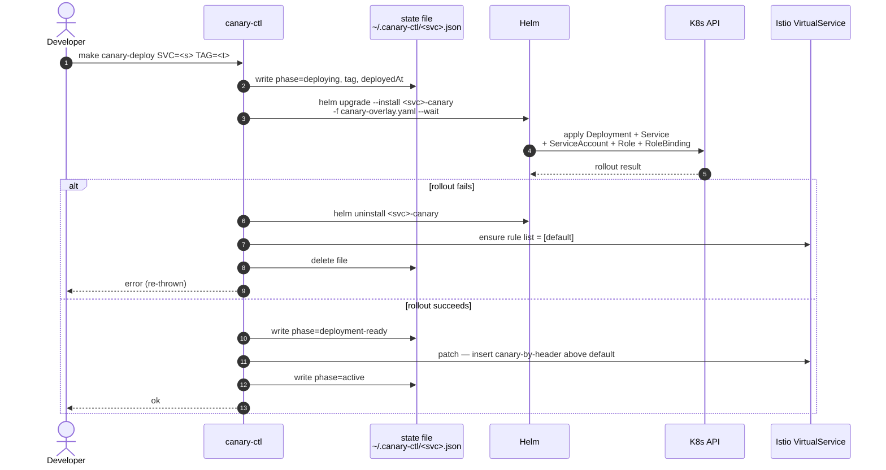
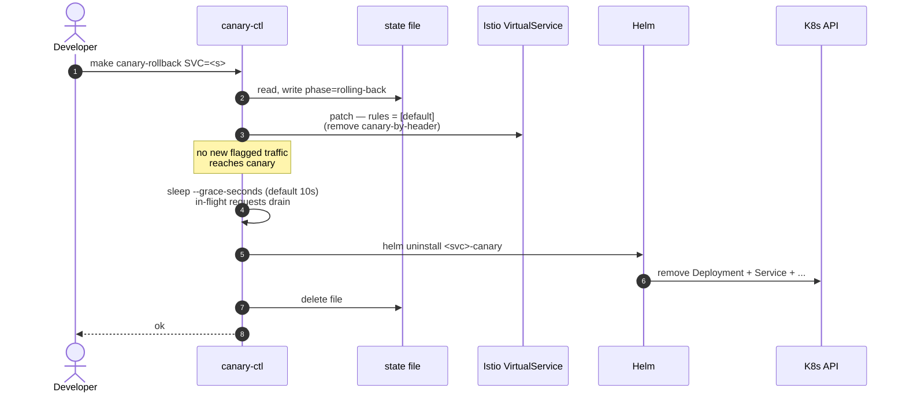

# Operations

End-to-end deploy, canary lifecycle, troubleshooting. Read
[architecture.md](architecture.md) for the system map and
[canary-mechanics.md](canary-mechanics.md) for what `canary-ctl` actually
does.

## Cold-cluster bring-up

From a freshly-cloned repo to a working substrate with all 5 services
deployed:

```bash
make up                      # ~4 min: kind + Istio + Strimzi/Kafka + Restate + addons
make smoke-infra             # 11 assertions; should be all green

make build-services          # Java bootJars + Node dist/
make build-images            # Docker build × 5
make load-images             # kind load × 5

make deploy-services         # KafkaTopics + Helm install × 5 + Istio routing
make smoke-services          # 5 deploy assertions

make pre-warm                # optional: seeds consumer offsets for e2e suites
```

Total: ~10 minutes on an M-series Mac.

### Cold-cluster pre-warm (optional)

`make pre-warm` sends 3 baseline (non-canary) orders, seeding every
consumer group's offset. **No longer required** — heartbeat-based
readiness lets canary pods reach Ready immediately on a cold cluster.
Useful before running e2e suites (K1–K5) that assert lag-related
behavior, since it gives every consumer a known starting offset.

Tunable knobs (env vars):

- `PRE_WARM_COUNT` (default 3)
- `PRE_WARM_DELAY_MS` (default 1000)
- `PRE_WARM_URL` (default `http://localhost:8080/api/orders`)

## Verifying the substrate

After `make up`:

```bash
kubectl get pods -A                    # everything Running/Ready
make status                            # short summary
kubectl auth can-i watch pods -n services \
  --as=system:serviceaccount:services:payment-service
# expected: yes  (presence-watcher RBAC)
```

After `make deploy-services`:

```bash
kubectl get -n services pods,svc,deploy
kubectl get -n services destinationrules,virtualservices
helm list -n services                  # 5 deployed releases

# Restate handler registration:
curl -s http://localhost:9070/deployments | jq '.deployments | length'
# expected: 5 (every service registers post-install via Helm Job)

# Edge gateway:
curl -s -X POST -H 'content-type: application/json' \
  -d '{"userId":"u1","sku":"sku-1","quantity":1,"amount":100}' \
  http://localhost:8080/api/orders | jq
# expected: 201, status="completed", x-served-version: stable
```

Open the dashboards while testing:

```bash
make dashboards         # Kiali / Grafana / Prometheus / Jaeger port-forwards (background)
make dashboards-status  # see which PIDs are up
make dashboards-stop    # close all four
```

| Dashboard | URL | Use for |
|---|---|---|
| Kiali | http://localhost:20001 | Per-subset traffic split (the canary smoke check) |
| Grafana | http://localhost:3000 | Istio + Kafka panels + canary dashboards (see below) |
| Prometheus | http://localhost:9090 | Raw metric queries (`canary_*` series) |
| Jaeger | http://localhost:16686 | Distributed traces (filter by `canary.lane`) |

### Canary observability dashboards (Phase 5.d)

Three canary-aware Grafana dashboards are installed by
`deploy/kind/observability/install.sh` as a sidecar-loaded ConfigMap
(`grafana_dashboard: "1"` label):

| Dashboard | UID | What it shows |
|---|---|---|
| Canary — Overview | `canary-overview` | Lane-active matrix, error rate + p95 latency by service × lane |
| Canary — Substrates | `canary-substrates` | Per-substrate (http / kafka / restate) request rate, error rate, duration heatmap, top-10 slowest targets |
| Canary — Traces | `canary-traces` | Jaeger trace search filtered by `service` + `lane` |

Re-apply the dashboards after editing the JSON sources in
`deploy/kind/observability/dashboards/`:

```bash
ISTIO_VERSION=$ISTIO_VERSION bash deploy/kind/observability/install.sh
```

When a dashboard surfaces an incident, follow one of the four runbooks
in [docs/runbooks/](runbooks/):

- [Canary burning budget](runbooks/canary-burning-budget.md) — canary error/latency clearly worse than stable
- [Canary lane drift](runbooks/canary-lane-drift.md) — `canary_lane_active` gauge in unexpected state
- [Canary lane stuck](runbooks/canary-lane-stuck.md) — past bake window without promotion or rollback
- [Restate invocation failure spike](runbooks/restate-invocation-failure-spike.md) — handler outcome != success

## Canary lifecycle

The wrapper for `canary-ctl`:

```bash
# Deploy a canary
make canary-deploy SVC=payment-service TAG=dev

# Send a flagged request
node tools/traffic-cli/bin/traffic-cli order --canary

# Inspect
make canary-status SVC=payment-service          # text
node tools/canary-ctl/bin/canary-ctl status payment-service --json   # machine-readable

# Roll back
make canary-rollback SVC=payment-service

# Repair drift (e.g. someone manually deleted the VS rule)
make canary-reconcile SVC=payment-service
```

Per-service state lives in `~/.canary-ctl/<service>.json`. Override with
`--state-dir` if you want isolation per-shell or per-test.

### Reading `canary-ctl status` output

```
service:    payment-service
state:      active                       ← phase from state file
tag:        dev
deployedAt: 2026-05-10T10:00:00Z
helm:       payment-service-canary [deployed]
vs-rules:   [canary-by-header, default]
drift:      (none)
```

Drift entries you might see:

| Drift entry | What it means | Fix |
|---|---|---|
| `state-without-helm` | state file present, no Helm release | `make canary-rollback` (idempotent) |
| `helm-without-state` | Helm release present, no state file | `make canary-reconcile --adopt` (or `rollback` to delete) |
| `header-rule-without-state` | VS has `canary-by-header`, no state file | `make canary-reconcile` |
| `state-without-header-rule` | state says `active`, VS has only `default` | `make canary-reconcile` |

`status` exits 2 when drift is non-empty; CI uses this.

### Sequence: canary-ctl deploy



### Sequence: canary-ctl rollback



Both flows are idempotent. Running `rollback` against a clean cluster
is a no-op; `reconcile` covers any drift between the state file and
cluster reality (see [canary-mechanics.md](canary-mechanics.md#status-svc-and-reconcile-svc)
for the reconcile policy).

> **Want to watch a canary deploy through the dashboards?** The
> [onboarding doc has a worked-example walkthrough](onboarding.md#manual-dashboard-walkthrough)
> across Kiali, Jaeger, Grafana, Prometheus, and the Restate admin API.

## End-to-end test runs

```bash
make e2e                       # all (S1–S13 + K1–K6 + R1–R7 + O1), ~20 min
make e2e SCENARIO=s7           # single one
make e2e SCENARIO=r6           # Restate isolation
make e2e SCENARIO=o1           # observability validator
make ci-local                  # S1, S2, S5, S8, S9, S12 — ~5 min
```

Each scenario file is self-contained — `beforeAll` deploys the canaries it
needs, `afterAll` rolls them back. If a run dies mid-test:

```bash
for svc in audit-service inventory-service notification-service order-service payment-service; do
  make canary-reconcile SVC=$svc
done
```

### Scenario coverage

**HTTP scenarios** (Phase 1.5):

| # | Name | What it asserts |
|---|---|---|
| S1 | Baseline | All-stable cluster: no-header AND header request both 2xx + `x-served-version: stable` |
| S2 | Single-service canary | Canary on payment → chain shows `payment-service=canary`, others stable |
| S3 | Multi-service canary | Canary on order + inventory → both `=canary`, others stable |
| S4 | Full-chain canary | Canary on all 5 → every chain entry `=canary` |
| S5 | No-canary fallback | Header request with no canary → stable serves |
| S6 | Canary unhealthy | Bad image tag → auto-rollback fires; final state clean |
| S7 | Stable undisrupted | p99 stable load during canary deploy ≤ 1.5× baseline |
| S8 | Header propagation completeness | Chain contains all 5 services |
| S9 | Header leak prevention | No-header request: no canary pod logs the user ID |
| S10 | Kafka isolation | Canary pods don't join Kafka consumer groups (Phase 1 invariant — superseded by K1–K5 in Phase 2) |
| S11 | Restate isolation | Canary pods don't register with Restate Admin |
| S12 | Rollback | Deploy + rollback → cluster fully clean |
| S13 | Partial-state recovery | Manual VS rule deletion → `canary-ctl reconcile` repairs |

**Kafka scenarios** (Phase 2.b):

| # | Name | What it asserts |
|---|---|---|
| K1 | Canary deployed + flagged event | Only canary's `consumedEventStore` records it |
| K2 | Canary deployed + unflagged event | Only stable's store records it |
| K3 | Canary NOT deployed + flagged event | Stable's store records it (graceful fallback) |
| K4 | Kafka header propagation | Canary's audit-service consumes flagged event → its downstream Kafka events also carry `x-canary: true` |
| K5 | Canary Kafka unhealthy | SIGSTOP'd canary → readiness fails → presence watcher flips → stable processes the next flagged event |
| K6 | Cold-cluster bring-up | Tear down + redeploy services + canary all without `make pre-warm`; helm `--wait` succeeds + canary readiness 200 within 30s. Opt-in via `RUN_COLD_CLUSTER_TESTS=true` (skipped by default; ~4 min) |

K1–K5 use `kubectl port-forward pod/<name>` (per subset) and query
`/internal/consumed-events` directly, since Istio's subset-by-header
routing is in-mesh-only and the edge gateway only routes `/api/orders`.
Helpers in [tests/e2e/helpers/](../tests/e2e/helpers/).

**Restate scenarios** (Phase 3.a + 3.b):

| # | Name | What it asserts |
|---|---|---|
| R1 | Saga happy path (each variant) | All four R-to-R steps fire; reservation confirmed |
| R2 | Payment compensation (each variant) | Payment refuses negative amount → reservation released |
| R3 | Notify compensation (each variant) | Notify refuses → payment refunded; reservation stays confirmed |
| R4 / R5 | Reservation-workflow slow path | Opt-in via `RUN_SLOW=1`; verifies long-running durable workflow + cancellation |
| R6 | Restate subset isolation under concurrent traffic | Flagged + unflagged orders run concurrently and each traverses its own subset end-to-end; no cross-subset handler invocations |
| R7 | Restate canary deployment lifecycle | Both variant deployments register without conflict, per-subset Services have correct selectors, in-flight isolation across canary teardown. Opt-in (requires a deployed canary on order-service) |

R1–R3 run on both variants via `describe.each([stable, canary])`. R6 is
the load-bearing β invariant test ("a `*Canary` invocation cannot reach
a stable handler"). R7's cluster-lifecycle assertions are gated behind
an env flag and are exercised manually rather than in CI.

**Observability scenario** (Phase 5.d):

| # | Name | What it asserts |
|---|---|---|
| O1 | Observability validator | Local: dashboard JSON parses with matching uid + title. Cluster: Grafana serves each dashboard by uid; Prometheus has `canary_request_total`, `canary_request_duration_seconds`, `canary_lane_active` with `lane=canary` samples; Jaeger has at least one trace tagged `canary.lane=canary` |

## Troubleshooting

### Canary pod stuck in `0/1 Running`, readiness 503

Check the canary's readiness probe:

```bash
kubectl -n services exec deploy/payment-service-canary \
  -- curl -s localhost:8081/actuator/health/readiness | jq
```

If `kafkaConsumer.status: OUT_OF_SERVICE`, the consumer's heartbeat has
gone stale (Java: `last-heartbeat-seconds-ago` exceeded the threshold;
Node: no `consumer.events.HEARTBEAT` within the threshold). Either:

- the canary's consumer hasn't joined the group yet (check
  `kafka-consumer-groups.sh --list`)
- the broker is unreachable from the canary pod
- threshold is set too aggressively (`canary.kafka-heartbeat-stale-ms` /
  `KAFKA_HEARTBEAT_STALE_MS`, default 15s; old `*-health-timeout-ms`
  names still accepted as deprecated aliases)

### "I don't see Java consumer groups in `kafka-consumer-groups.sh --list`"

This is the Spring Boot 4 regression — see
[development.md](development.md#known-spring-boot-4-quirks). Verify:

- `*Application.java` has `@EnableKafka`
- `XCanaryAutoConfiguration` provides `ConsumerFactory` AND
  `kafkaListenerContainerFactory` beans
- nothing else has shadowed those bean names

### State drift: `make canary-status` exits 2

Run `make canary-reconcile SVC=<svc>`. It interprets the state file ×
cluster cross-product and brings them to consistency. Use
`canary-ctl reconcile --adopt` if you want to keep an orphan Helm
release rather than uninstall it.

### `make e2e SCENARIO=k1` hangs past 5 minutes

Known issue — see [Known issues](#known-issues) below.

### Pods are healthy but `/api/orders` returns 502

Likely the saga timed out reaching one of the 4 downstream services.
Check:

```bash
kubectl -n services logs deploy/order-service-stable --tail 100
```

If it's a Kafka send failure, confirm `KAFKA_PRODUCER_ENABLED=true` in
the values file (it's `true` by default).

## Tear-down

```bash
make undeploy-services   # remove routing, Helm releases, KafkaTopics; keep cluster
make down                # delete the kind cluster entirely
```

`make down` is destructive but reversible — `make up` rebuilds
everything in ~4 minutes.

## Known issues

### K1 e2e saga timeout (deferred)

K1's `beforeAll` (5 sequential canary deploys) succeeds, but the test
phase (`sendOrder({canary: true})` POST → saga calls inventory + payment
+ notification with `x-canary: true`) hangs past vitest's 300s
`testTimeout`. Pre-warm orders during the same window show ~50% timeout
rate. Likely culprits to investigate before re-enabling K1–K5 cluster
verification:

- Istio header-based subset routing loop (canary → downstream → back to canary)
- Restate handler registration race with canary in the mesh
- Saga HTTP client lacking per-call timeout (axios defaults to no timeout)

Tracked as a Phase 2 follow-up. K1–K5 still pass at the unit-test layer;
the gap is cluster-only.

### Phase 2.c — schema evolution (deferred)

Today every event is plain JSON via `objectMapper.writeValueAsString(charge)`
(Java) / `JSON.stringify` (Node), with no `schemaVersion` field, no
schema registry, and no compatibility policy. This works while every
service runs the same event class but breaks the moment a canary changes
an event's shape. Tracked separately; brainstorming the registry +
wire-format choice (Confluent / Apicurio / Karapace, JSON / Avro /
Protobuf) is its own session.

## Phase 3.b trade-offs + operational notes

Phase 3.b's β routing (variant-isolated `*Stable` / `*Canary` service
names) shipped 2026-05-11. See
[canary-mechanics.md → Restate path](canary-mechanics.md#restate-path)
for the routing model. Two trade-offs are worth keeping in mind during
operations:

**No automatic stable-takes-over fallback (asymmetric with Phase 2).**
Phase 2's Kafka path implements rule #2 — "if `x-canary=true` AND canary
pod NOT deployed, stable processes" — via a K8s pod-watch
(`canaryReady` boolean) plus a per-message filter on stable's
`@KafkaListener`. Phase 3.b does **not** replicate this. The
order-service HTTP controller routes by `x-canary` header alone; when
canary is unhealthy, flagged requests still POST to
`/CheckoutSagaCanary/...` and Restate either 404s or retries the dead
URL until the operator intervenes. Failure surfaces as HTTP 502/503 —
observable to the client (unlike Phase 2's Kafka black-hole risk that
made fallback essential). Operational mitigation: standard pod
readiness alarms + stop flagged traffic at the Istio VirtualService
during canary outages. If automatic fallback is needed in a production
fork, extend Phase 2's `presenceWatcher` in order-service to publish a
`canaryReady` boolean and have the controller fall through to `*Stable`
when canary is unhealthy.

**Restate's pause-resume recovery is unavailable in β.** Restate's
[versioning docs](https://docs.restate.dev/services/versioning)
recommend `restate invocations pause <id>` followed by
`restate invocations resume <id> --deployment <new_id>` as the
preferred mechanism for redirecting in-flight work off a buggy or
torn-down deployment. That primitive requires the resume target to
expose the **same service name** as the original. β registers
`CheckoutSagaCanary` and `CheckoutSagaStable` as **distinct services**,
so a `*Canary` invocation cannot be resumed onto the stable deployment
— Restate would fail with "service not found." This is a structural
cost of choosing β over α, not a bug.

### Canary teardown runbook (β routing)

Recovery in β is limited to **drain-and-remove**, with
`restate invocations cancel` as the only escape hatch for stuck work.
Pause-resume is not available — see the rationale above.

#### Procedure

1. **Stop new flagged traffic.** Edit the Istio VirtualService route to
   100% stable subset, or remove the canary subset rule. New
   `x-canary: true` requests now hit the stable saga.

2. **Inventory in-flight `*Canary` invocations:**

   ```
   restate deployment describe <canary-deployment-id> --extra
   ```

3. **Drain — choose mode:**

   **(a) Graceful (preferred when latency budget allows).** Let
   in-flights finish naturally. `ReservationWorkflowCanary.run` parks
   on a 120s timer, so worst-case wait per saga is ~2 minutes. Watch:

   ```
   watch restate deployment describe <canary-deployment-id> --extra
   ```

   Wait until the in-flight count is 0. `canary-ctl rollback` follows
   this path with a `--grace-seconds` (default 10) drain window.

   **(b) Emergency (when canary pods are gone or the deployment is
   genuinely buggy).** Cancel each in-flight invocation:

   ```
   for id in $(restate invocations list --deployment <canary-deployment-id> --json | jq -r '.[].id'); do
     restate invocations cancel "$id"
   done
   ```

   Cancellation triggers Restate's compensation path **only if the saga
   catches the cancellation signal** — the current Phase 3.b sagas do
   not handle cancellation explicitly, so durable side effects (Charges
   in `succeeded` state, Reservations in `reserved` state) may be left
   mid-flight. Operators must manually reconcile via the per-service
   admin endpoints (`POST /api/orders/<id>/refund`,
   `POST /api/reservations/<id>/release`, etc.) if applicable.

   *Pause-resume is not an option.* If a future operator runs
   `restate invocations resume <id> --deployment <stable-deployment-id>`,
   Restate will refuse — the stable deployment doesn't expose
   `CheckoutSagaCanary`. This is by design.

4. **Deregister the canary deployment from Restate:**

   ```
   restate deployments remove <canary-deployment-id>
   ```

   Add `--force` only if step 3 used emergency mode and you've already
   accepted the partial-state cost.

5. **Tear down the K8s release:**

   ```
   helm uninstall <canary-release> -n services
   ```

Skipping step 3 leaves Restate retrying dead URLs indefinitely.
Skipping step 4 means future canary installs that re-register at the
same URL will collide.
