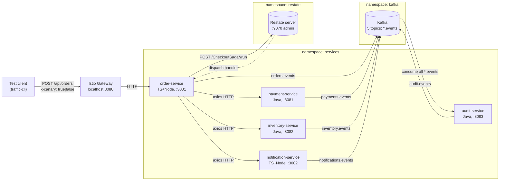
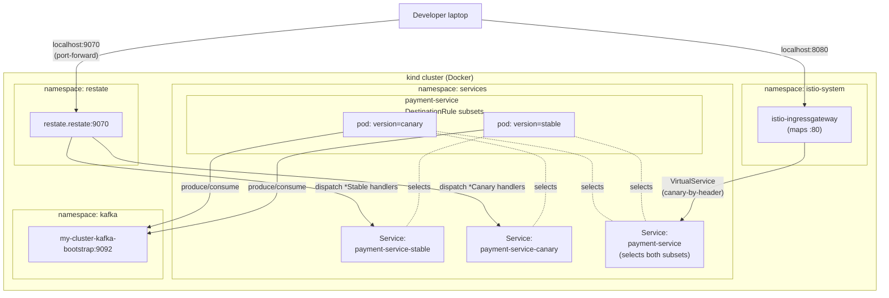
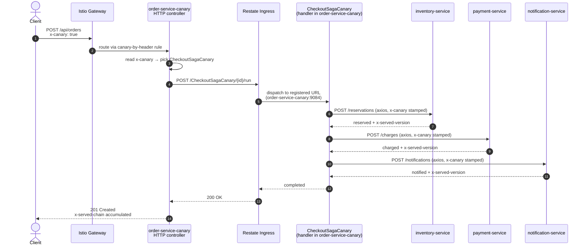
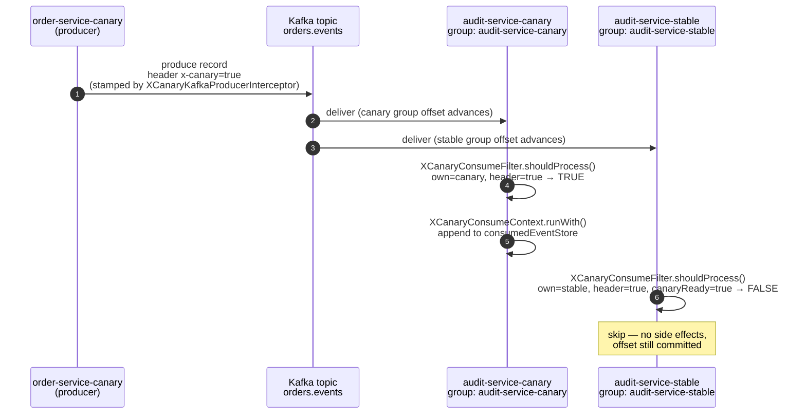
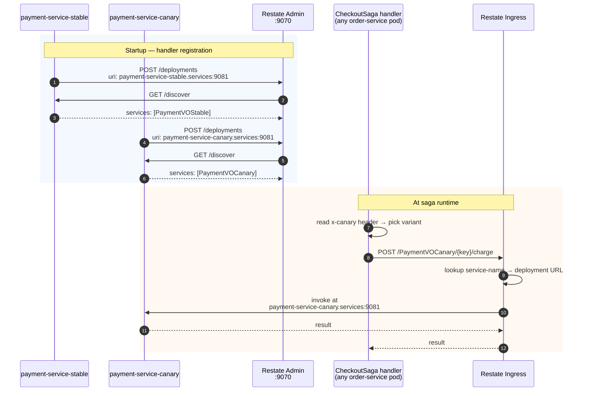
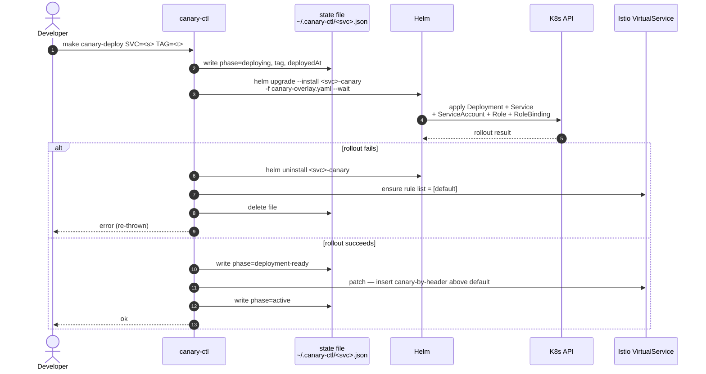
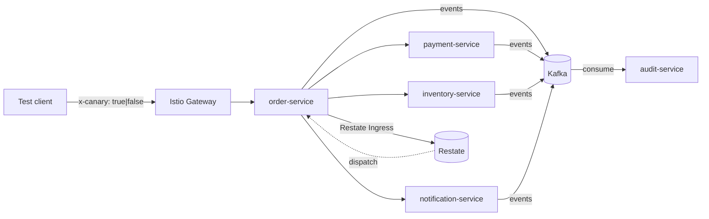

# Onboarding doc + Mermaid diagrams — implementation plan

> **For agentic workers:** REQUIRED SUB-SKILL: Use superpowers:subagent-driven-development (recommended) or superpowers:executing-plans to implement this plan task-by-task. Steps use checkbox (`- [ ]`) syntax for tracking.

**Goal:** Make `canary-release-mgmt` digestible to a new developer in a single top-to-bottom read, by adding `docs/onboarding.md` (front door + dashboard walkthrough) and 8 Mermaid diagrams (2 architectural + 6 sequence) inside the existing docs. Reflects Phase 1 + 2 + 3.a + 3.b.

**Architecture:** Documentation-only change. One new markdown file plus targeted insertions into 4 existing docs and a one-line README tweak. Existing ASCII art stays intact; Mermaid is additive. Each task makes one focused change to one file and ends with a commit so a reviewer can read the history scenario-by-scenario.

**Tech Stack:** Markdown + Mermaid (GitHub-native rendering, no build step). Validation = visual inspection + Mermaid syntax compile via `npx -y -p @mermaid-js/mermaid-cli@latest mmdc` on a temp extract.

**Companion spec:** [docs/superpowers/specs/2026-05-11-onboarding-and-diagrams-design.md](../specs/2026-05-11-onboarding-and-diagrams-design.md). Keep that open while executing — the diagram inventory section is the canonical source for what each one shows.

---

## File map

| File | Action | Inserts |
|---|---|---|
| `README.md` | modify | one row added to "Documentation" table |
| `docs/architecture.md` | modify | 2 Mermaid diagrams (system context, network topology) |
| `docs/canary-mechanics.md` | modify | 4 Mermaid sequence diagrams (HTTP saga, Kafka K1, Restate β, K5 takeover); 1 new `## Restate path` section |
| `docs/operations.md` | modify | 2 Mermaid sequence diagrams (canary-ctl deploy, rollback); 1 line linking to the onboarding dashboard walkthrough |
| `docs/onboarding.md` | **create** | new front-door file (~250 lines) |

All edits use the Edit tool with `old_string`/`new_string` so anchors are exact. After every edit, verify by Reading back ~15 lines around the insertion.

---

## Task 1 — README pointer to onboarding doc

**Files:**
- Modify: `README.md` (the "Documentation" table)

- [ ] **Step 1: Edit README.md to add an onboarding doc row above the architecture row**

```python
# Use Edit tool with these exact strings:
old_string = """| Document | What's in it |
|---|---|
| [docs/architecture.md](docs/architecture.md) | System map, the 5 services, repo layout, lib-java vs lib-node primitives |"""

new_string = """| Document | What's in it |
|---|---|
| [docs/onboarding.md](docs/onboarding.md) | **Start here.** Mental model, first-30-minutes commands, dashboard walkthrough |
| [docs/architecture.md](docs/architecture.md) | System map, the 5 services, repo layout, lib-java vs lib-node primitives |"""
```

- [ ] **Step 2: Verify**

Read `README.md` lines 55-70 to confirm the new row reads cleanly and renders as the first entry in the table.

- [ ] **Step 3: Commit**

```bash
git add README.md
git commit -m "$(cat <<'EOF'
docs(readme): point new devs at docs/onboarding.md first

Co-Authored-By: Claude Opus 4.7 (1M context) <noreply@anthropic.com>
EOF
)"
```

---

## Task 2 — architecture.md: system context Mermaid diagram

**Files:**
- Modify: `docs/architecture.md` (after the existing ASCII art in `## High-level system`)

- [ ] **Step 1: Edit architecture.md to insert the Mermaid block after the ASCII art**

Use Edit tool. The `old_string` ends at the closing ``` of the ASCII fence on line 45; insert the Mermaid block before the `## Substrates (Phase 1.1)` heading.

```python
old_string = """   Restate (`localhost:9070` admin) — every service registers its handlers
   on startup; saga orchestration lands here in Phase 3.
```

## Substrates (Phase 1.1)"""

new_string = """   Restate (`localhost:9070` admin) — every service registers its handlers
   on startup; saga orchestration lands here in Phase 3.
```

Rendered version (GitHub):



## Substrates (Phase 1.1)"""
```

- [ ] **Step 2: Verify Mermaid compiles**

Extract the Mermaid block to `/tmp/sys-ctx.mmd` (copy the lines between the ` ```mermaid ` and ` ``` ` fences) and run:

```bash
npx -y -p @mermaid-js/mermaid-cli@latest mmdc -i /tmp/sys-ctx.mmd -o /tmp/sys-ctx.svg
# Expected: writes /tmp/sys-ctx.svg with no parse errors.
```

If `npx` is gated by network: skip and rely on Step 3 visual check.

- [ ] **Step 3: Visual check**

Read `docs/architecture.md` lines 40-90 to confirm the block sits cleanly between the ASCII art and the Substrates heading, and nothing else got mangled.

- [ ] **Step 4: Commit**

```bash
git add docs/architecture.md
git commit -m "$(cat <<'EOF'
docs(architecture): add Mermaid system-context diagram

Renders natively in GitHub; complements the existing ASCII art.

Co-Authored-By: Claude Opus 4.7 (1M context) <noreply@anthropic.com>
EOF
)"
```

---

## Task 3 — architecture.md: network topology Mermaid diagram

**Files:**
- Modify: `docs/architecture.md` (add a new `## Network topology` section right after `## Substrates (Phase 1.1)` table, before `## The five services`)

- [ ] **Step 1: Edit architecture.md to insert the new section**

```python
old_string = """Versions are pinned at the top of [Makefile](../Makefile). Restate
server 1.6.2 is wire-compatible with the Java SDK 2.7.0 and the Node SDK
1.14.2 — do not bump the server pin without testing both SDKs.

## The five services"""

new_string = """Versions are pinned at the top of [Makefile](../Makefile). Restate
server 1.6.2 is wire-compatible with the Java SDK 2.7.0 and the Node SDK
1.14.2 — do not bump the server pin without testing both SDKs.

## Network topology

How K8s namespaces, per-subset Services, and the two cluster-edge port
mappings line up. `payment-service` is shown with both subsets to
illustrate the pattern — every service has the same shape after a
canary is deployed.



Restate's dispatch path bypasses Istio's DestinationRule subsetting
because Restate's pods sit outside the Istio mesh. The per-subset K8s
Services (`<svc>-stable` / `<svc>-canary`) give Restate variant-isolated
URLs to register against — see [canary-mechanics.md](canary-mechanics.md#restate-path)
for the Phase 3.b β routing details.

## The five services"""
```

- [ ] **Step 2: Verify Mermaid compiles**

```bash
# Extract block to /tmp/net-topo.mmd, then:
npx -y -p @mermaid-js/mermaid-cli@latest mmdc -i /tmp/net-topo.mmd -o /tmp/net-topo.svg
# Expected: writes /tmp/net-topo.svg with no parse errors.
```

- [ ] **Step 3: Visual check**

Read `docs/architecture.md` lines 56-120 to confirm the new section is well-formed and the following `## The five services` heading is intact.

- [ ] **Step 4: Commit**

```bash
git add docs/architecture.md
git commit -m "$(cat <<'EOF'
docs(architecture): add Mermaid network topology diagram

Shows per-subset K8s Services and how Restate dispatch bypasses Istio's
mesh subsetting (relevant for Phase 3.b β routing).

Co-Authored-By: Claude Opus 4.7 (1M context) <noreply@anthropic.com>
EOF
)"
```

---

## Task 4 — canary-mechanics.md: HTTP saga sequence diagram

**Files:**
- Modify: `docs/canary-mechanics.md` (in `## HTTP path`, after the `### 4. Response stamping` subsection — insert a new `### 5. Full request sequence (Restate-orchestrated, Phase 3.a)` subsection before the `## Kafka path` heading)

- [ ] **Step 1: Edit canary-mechanics.md**

```python
old_string = """- `x-served-chain: order-service=canary, payment-service=stable, ...` — each
  service appends its own token AND propagates the downstream chain by
  reading the response header from RestClient/axios calls. Test code uses
  this to verify multi-hop routing without Jaeger.

## Kafka path"""

new_string = """- `x-served-chain: order-service=canary, payment-service=stable, ...` — each
  service appends its own token AND propagates the downstream chain by
  reading the response header from RestClient/axios calls. Test code uses
  this to verify multi-hop routing without Jaeger.

### 5. Full request sequence (Restate-orchestrated, Phase 3.a)

Since Phase 3.a, the `/api/orders` saga is durable: the order-service
HTTP controller submits to the Restate Ingress, and the
`CheckoutSaga{Stable,Canary}` handler (running in the order-service pod
itself) drives the inventory → payment → notification calls.



Without the header, the controller picks `CheckoutSagaStable` and the
exact same flow runs through the stable subsets at each hop.

## Kafka path"""
```

- [ ] **Step 2: Verify Mermaid compiles**

```bash
npx -y -p @mermaid-js/mermaid-cli@latest mmdc -i /tmp/http-saga.mmd -o /tmp/http-saga.svg
# Expected: no parse errors.
```

- [ ] **Step 3: Visual check**

Read `docs/canary-mechanics.md` lines 98-150 to confirm the new subsection sits between `### 4. Response stamping` and `## Kafka path`.

- [ ] **Step 4: Commit**

```bash
git add docs/canary-mechanics.md
git commit -m "$(cat <<'EOF'
docs(canary-mechanics): add HTTP saga Mermaid sequence diagram

Shows the Phase 3.a Restate-orchestrated saga path end to end, with
x-canary propagation across the 4 hops.

Co-Authored-By: Claude Opus 4.7 (1M context) <noreply@anthropic.com>
EOF
)"
```

---

## Task 5 — canary-mechanics.md: Kafka K1 sequence diagram

**Files:**
- Modify: `docs/canary-mechanics.md` (in `## Kafka path`, after the `### Context pinning on consume` subsection, before the `## Presence watching` heading)

- [ ] **Step 1: Find the exact anchor**

Read `docs/canary-mechanics.md` and locate the line containing `Java reads the kafka-clients metric` (currently around line 176). The block ending with `ConsumerPartitionsAssignedEvent` / `ConsumerPartitionsRevokedEvent`).` immediately precedes `## Presence watching`.

- [ ] **Step 2: Edit canary-mechanics.md**

```python
old_string = """Java reads the kafka-clients metric `last-heartbeat-seconds-ago` driven
by a `ConsumerAwareRebalanceListener` (substituted for the spring-kafka
4.0.4-missing `ConsumerPartitionsAssignedEvent` /
`ConsumerPartitionsRevokedEvent`).

## Presence watching: how stable knows when canary is unavailable"""

new_string = """Java reads the kafka-clients metric `last-heartbeat-seconds-ago` driven
by a `ConsumerAwareRebalanceListener` (substituted for the spring-kafka
4.0.4-missing `ConsumerPartitionsAssignedEvent` /
`ConsumerPartitionsRevokedEvent`).

### Sequence: K1 — flagged event reaches canary, skipped by stable

This is the K1 e2e scenario. Both subsets receive the record (different
consumer groups, same topic); the per-message filter decides who acts.



K2 (unflagged event) is the mirror image: stable processes, canary
skips. K3 (flagged event, no canary deployed) is the graceful fallback
— stable's filter returns TRUE because `canaryReady=false`.

## Presence watching: how stable knows when canary is unavailable"""
```

- [ ] **Step 3: Verify Mermaid compiles**

```bash
npx -y -p @mermaid-js/mermaid-cli@latest mmdc -i /tmp/kafka-k1.mmd -o /tmp/kafka-k1.svg
# Expected: no parse errors.
```

- [ ] **Step 4: Visual check**

Read `docs/canary-mechanics.md` around the inserted block to confirm the K1 section sits cleanly between the Kafka path text and `## Presence watching`.

- [ ] **Step 5: Commit**

```bash
git add docs/canary-mechanics.md
git commit -m "$(cat <<'EOF'
docs(canary-mechanics): add Kafka K1 Mermaid sequence diagram

Shows per-subset consumer groups + the per-message filter decision
for the canary-flagged event path.

Co-Authored-By: Claude Opus 4.7 (1M context) <noreply@anthropic.com>
EOF
)"
```

---

## Task 6 — canary-mechanics.md: K5 takeover sequence diagram

**Files:**
- Modify: `docs/canary-mechanics.md` (in `## Presence watching`, just before the `## RBAC` heading — replace the existing ASCII-style numbered list "### How a canary failure becomes a stable takeover (K5 scenario)" with the Mermaid version, keeping the prose intro)

- [ ] **Step 1: Read the existing K5 numbered list**

Read `docs/canary-mechanics.md` lines 195-210 to confirm the current "### How a canary failure becomes a stable takeover (K5 scenario)" block and its 7 numbered steps.

- [ ] **Step 2: Edit canary-mechanics.md — add Mermaid AFTER the existing numbered list (keep both for readers who prefer prose)**

```python
old_string = """### How a canary failure becomes a stable takeover (K5 scenario)

1. Canary pod's Kafka consumer wedges (network blip, GC pause, SIGSTOP, etc.).
2. The canary's heartbeat thread is frozen by SIGSTOP, so
   `last-heartbeat-seconds-ago` (Java) / `consumer.events.HEARTBEAT`
   (Node) goes stale beyond `canary.kafka-heartbeat-stale-ms` (default 15s).
3. The `KafkaConsumerHealthIndicator` reports `OUT_OF_SERVICE`.
4. **Canary's** readiness probe fails (canary's `/health` or actuator
   `kafkaConsumer` is in the readiness group).
5. Kubelet drops the canary pod from the EndpointSlice; pod transitions to
   `Ready=False`.
6. Stable pods' `XCanaryPresenceWatcher` receives the watch event; flag
   flips `canaryReady = false`.
7. Stable processes the next flagged message that arrives → graceful fallback."""

new_string = """### How a canary failure becomes a stable takeover (K5 scenario)

1. Canary pod's Kafka consumer wedges (network blip, GC pause, SIGSTOP, etc.).
2. The canary's heartbeat thread is frozen by SIGSTOP, so
   `last-heartbeat-seconds-ago` (Java) / `consumer.events.HEARTBEAT`
   (Node) goes stale beyond `canary.kafka-heartbeat-stale-ms` (default 15s).
3. The `KafkaConsumerHealthIndicator` reports `OUT_OF_SERVICE`.
4. **Canary's** readiness probe fails (canary's `/health` or actuator
   `kafkaConsumer` is in the readiness group).
5. Kubelet drops the canary pod from the EndpointSlice; pod transitions to
   `Ready=False`.
6. Stable pods' `XCanaryPresenceWatcher` receives the watch event; flag
   flips `canaryReady = false`.
7. Stable processes the next flagged message that arrives → graceful fallback.

As a sequence diagram:

```mermaid
sequenceDiagram
    autonumber
    participant CC as canary's<br/>Kafka consumer
    participant Health as canary's<br/>/health/readiness
    participant Kubelet
    participant ES as EndpointSlice<br/>controller
    participant Watcher as stable's<br/>XCanaryPresenceWatcher
    participant SL as stable's<br/>Kafka listener
    participant Topic as Kafka topic

    rect rgba(255,200,200,0.15)
        note over CC: SIGSTOP / GC / network blip
        CC--xCC: heartbeat thread frozen
    end
    note over CC: last-heartbeat-seconds-ago > 15s

    Kubelet->>Health: GET /health/readiness
    Health-->>Kubelet: 503 (kafkaConsumer: OUT_OF_SERVICE)
    Kubelet->>ES: pod Ready=False
    ES->>Watcher: watch event MODIFIED<br/>(canary pod Ready=False)
    Watcher->>Watcher: canaryReady = false<br/>(atomic)

    Topic->>SL: deliver flagged record<br/>(x-canary=true)
    SL->>SL: shouldProcess()<br/>own=stable, header=true,<br/>canaryReady=false → TRUE
    SL->>SL: process (graceful fallback)
```"""
```

- [ ] **Step 3: Verify Mermaid compiles**

```bash
npx -y -p @mermaid-js/mermaid-cli@latest mmdc -i /tmp/k5.mmd -o /tmp/k5.svg
# Expected: no parse errors.
```

- [ ] **Step 4: Visual check**

Read `docs/canary-mechanics.md` around the K5 block to confirm both the original numbered list and the new Mermaid diagram are present.

- [ ] **Step 5: Commit**

```bash
git add docs/canary-mechanics.md
git commit -m "$(cat <<'EOF'
docs(canary-mechanics): add K5 takeover Mermaid sequence diagram

Augments the existing numbered list with a sequence-diagram view of
the canary-failure → stable-takeover flow.

Co-Authored-By: Claude Opus 4.7 (1M context) <noreply@anthropic.com>
EOF
)"
```

---

## Task 7 — canary-mechanics.md: add `## Restate path` section + β dispatch sequence diagram

**Files:**
- Modify: `docs/canary-mechanics.md` (insert new `## Restate path` section AFTER `## RBAC: presence watcher needs pods/watch`, BEFORE `## The canary-ctl lifecycle`)

- [ ] **Step 1: Locate the anchor**

Read `docs/canary-mechanics.md` and confirm the section ordering: `## RBAC: presence watcher needs pods/watch` → `## The canary-ctl lifecycle`. The smoke-check `kubectl auth can-i ...` block is the last thing in the RBAC section.

- [ ] **Step 2: Edit canary-mechanics.md**

```python
old_string = """```bash
kubectl auth can-i watch pods -n services \\
  --as=system:serviceaccount:services:payment-service
# expected: yes
```

## The `canary-ctl` lifecycle"""

new_string = """```bash
kubectl auth can-i watch pods -n services \\
  --as=system:serviceaccount:services:payment-service
# expected: yes
```

## Restate path

Restate provides the saga's durability (Phase 3.a) and the
variant-isolated handler dispatch (Phase 3.b β routing). The two
shipping invariants:

1. **Distinct service names per subset.** Stable pods register
   `CheckoutSagaStable`, `ReservationWorkflowStable`,
   `PaymentVOStable`, `NotificationServiceStable`. Canary pods
   register the same handlers under `*Canary` names. Per-subset K8s
   Services (`<svc>-stable` / `<svc>-canary`) give Restate
   variant-isolated URLs to register against, since Restate's pods sit
   outside the Istio mesh and cannot use DestinationRule subsetting.
2. **Variant chosen at invocation time by header.** The order-service
   HTTP controller reads `x-canary` on the incoming request and
   POSTs to either `/CheckoutSagaStable/{id}/run` or
   `/CheckoutSagaCanary/{id}/run`. Saga handlers do the same when
   calling other Restate services.

### Sequence: registration + variant dispatch



Variant isolation is enforced by three independent layers
(registration under distinct names, in-saga client construction
picking `*Stable` vs `*Canary`, K8s endpoint selection via per-subset
Services). A `*Canary` invocation **cannot** reach a stable handler —
this is the load-bearing β invariant.

### Asymmetry: no automatic stable-takes-over fallback

Phase 2's Kafka path implements graceful fallback ("if `x-canary=true`
AND canary pod NOT deployed, stable processes") via the
`XCanaryPresenceWatcher` + per-message filter. **Phase 3.b does not
replicate this.** The order-service HTTP controller routes by header
alone; when canary is unhealthy, flagged requests still POST to
`/CheckoutSagaCanary/...` and Restate either 404s or retries the dead
URL until an operator intervenes. Failure surfaces as HTTP 502/503 —
observable to the client (unlike Phase 2's Kafka black-hole risk that
made fallback essential).

For the full operational runbook (graceful vs emergency canary
teardown, Restate CLI commands), see
[operations.md](operations.md#restate-canary-handler-versioning-phase-3b)
and the Phase 3.b spec at
[`docs/superpowers/specs/2026-05-11-canary-release-phase-3-b-canary-handler-versioning-design.md`](superpowers/specs/2026-05-11-canary-release-phase-3-b-canary-handler-versioning-design.md).

## The `canary-ctl` lifecycle"""
```

- [ ] **Step 3: Verify Mermaid compiles**

```bash
npx -y -p @mermaid-js/mermaid-cli@latest mmdc -i /tmp/restate-beta.mmd -o /tmp/restate-beta.svg
# Expected: no parse errors.
```

- [ ] **Step 4: Visual check**

Read `docs/canary-mechanics.md` around the new `## Restate path` heading to confirm it sits between RBAC and the `canary-ctl` lifecycle section.

- [ ] **Step 5: Commit**

```bash
git add docs/canary-mechanics.md
git commit -m "$(cat <<'EOF'
docs(canary-mechanics): add Restate path section + β dispatch diagram

Documents Phase 3.a durability + Phase 3.b variant-isolated handler
dispatch, including the no-fallback asymmetry vs Phase 2 Kafka.

Co-Authored-By: Claude Opus 4.7 (1M context) <noreply@anthropic.com>
EOF
)"
```

---

## Task 8 — operations.md: canary-ctl deploy + rollback sequence diagrams

**Files:**
- Modify: `docs/operations.md` (in `## Canary lifecycle`, append two Mermaid diagrams + a one-line dashboard-walkthrough pointer)

- [ ] **Step 1: Locate the anchor**

The `## Canary lifecycle` section ends with the drift-table; the next heading is `## End-to-end test runs`. The Mermaid block goes right after the drift table, before the e2e heading.

- [ ] **Step 2: Edit operations.md**

```python
old_string = """`status` exits 2 when drift is non-empty; CI uses this.

## End-to-end test runs"""

new_string = """`status` exits 2 when drift is non-empty; CI uses this.

### Sequence: canary-ctl deploy



### Sequence: canary-ctl rollback

```mermaid
sequenceDiagram
    autonumber
    actor Dev as Developer
    participant CLI as canary-ctl
    participant State as state file
    participant VS as Istio VirtualService
    participant Helm
    participant K8s as K8s API

    Dev->>CLI: make canary-rollback SVC=<s>
    CLI->>State: read; write phase=rolling-back
    CLI->>VS: patch — rules = [default]<br/>(remove canary-by-header)
    note over CLI: no new flagged traffic<br/>reaches canary
    CLI->>CLI: sleep --grace-seconds (default 10s)<br/>in-flight requests drain
    CLI->>Helm: helm uninstall <svc>-canary
    Helm->>K8s: remove Deployment + Service + ...
    CLI->>State: delete file
    CLI-->>Dev: ok
```

Both flows are idempotent. Running `rollback` against a clean cluster
is a no-op; `reconcile` covers any drift between the state file and
cluster reality (see [canary-mechanics.md](canary-mechanics.md#status-svc-and-reconcile-svc)
for the reconcile policy).

> **Want to watch a canary deploy through the dashboards?** The
> [onboarding doc has a worked-example walkthrough](onboarding.md#5-manual-dashboard-walkthrough)
> across Kiali, Jaeger, Grafana, Prometheus, and the Restate admin API.

## End-to-end test runs"""
```

- [ ] **Step 3: Verify Mermaid compiles**

```bash
npx -y -p @mermaid-js/mermaid-cli@latest mmdc -i /tmp/ctl-deploy.mmd -o /tmp/ctl-deploy.svg
npx -y -p @mermaid-js/mermaid-cli@latest mmdc -i /tmp/ctl-rollback.mmd -o /tmp/ctl-rollback.svg
# Expected: no parse errors for either.
```

- [ ] **Step 4: Visual check**

Read `docs/operations.md` around the inserted block to confirm both diagrams + the dashboard-walkthrough callout sit between the drift table and `## End-to-end test runs`.

- [ ] **Step 5: Commit**

```bash
git add docs/operations.md
git commit -m "$(cat <<'EOF'
docs(operations): add canary-ctl deploy + rollback sequence diagrams

Also adds a pointer to the onboarding doc's dashboard walkthrough so
operators have a worked example to follow.

Co-Authored-By: Claude Opus 4.7 (1M context) <noreply@anthropic.com>
EOF
)"
```

---

## Task 9 — Create docs/onboarding.md

**Files:**
- Create: `docs/onboarding.md`

This is the largest single task. The full file content follows. Write it verbatim with the Write tool.

- [ ] **Step 1: Create docs/onboarding.md with this content**

````markdown
# Onboarding — canary-release-mgmt

If you've never touched this repo, start here. This doc gets you to
a working canary in 30 minutes, then shows you how to *see* it
working through the dashboards. Deep dives are linked at the bottom.

## What this is (60 seconds)

A reference architecture for canary release management across **three
substrates** — HTTP, Kafka, and Restate.dev — in a polyglot
microservice system. Five domain services (3 Java + Spring Boot 4,
2 TypeScript + Node) deploy to a local **kind** cluster behind Istio,
exchange events through Kafka, and orchestrate a durable saga through
Restate. A single `x-canary: true` HTTP header drives canary routing
on every substrate.

The interesting bit is **how** that works: per-subset Istio routing
for HTTP, per-subset Kafka consumer groups, a presence-watch protocol
so stable can take over when canary becomes unhealthy, and
variant-isolated Restate handler names (`*Stable` / `*Canary`) so
durable workflows can't accidentally cross subsets.

Read [architecture.md](architecture.md) for the long version of the
system map and [canary-mechanics.md](canary-mechanics.md) for what the
header actually does.

## Mental model — four invariants



The four invariants you need in your head:

1. **The header propagates automatically.** Every service that
   receives `x-canary: true` forwards it on every downstream HTTP,
   Kafka, and Restate call. Done by `platform/lib-java` and
   `platform/lib-node` — service code never reads or writes the header
   directly.
2. **Per-subset Kafka consumer groups.** Stable and canary consume
   the same topics via *different* consumer groups
   (`<svc>-stable` / `<svc>-canary`). Group rebalances never move
   partitions between subsets, and each subset has its own offset
   cursor.
3. **Presence-watch fallback.** Stable processes flagged messages
   only when canary is unhealthy. A long-lived k8s pod-watch flips
   the `canaryReady` flag in stable pods; the per-message Kafka
   filter reads it on every record. Detection lag is typically <1s.
4. **Durable orchestration with variant-isolated handlers.** The
   `/api/orders` saga is orchestrated by Restate (Phase 3.a), not by
   ad-hoc axios calls. Each variant registers under a distinct
   service name (`CheckoutSagaStable` / `CheckoutSagaCanary`); the
   order-service controller picks which one to invoke based on the
   header (Phase 3.b β routing). A `*Canary` invocation cannot reach
   a stable handler.

## Repo layout in 90 seconds

```
canary-release-mgmt/
├── Makefile                # primary entrypoint — every workflow is a target
├── deploy/                 # kind / Istio / Helm / KafkaTopics / routing
│   ├── helm/service-chart  # ONE chart parameterized for all 5 services
│   ├── helm/values         # per-service values + canary-overlay.yaml
│   └── routing             # DestinationRule + VirtualService per service + Gateway
├── platform/
│   ├── lib-java            # Spring Boot 4 starter (header filters, interceptors,
│   │                       #   watchers, health) — change here for SB4 services
│   ├── lib-node            # TS package (Express middleware + axios/KafkaJS
│   │                       #   interceptors) — change here for Node services
│   └── restate-defs-{java,node}   # cross-service Restate contracts
│                                  # (*Stable / *Canary split lives here)
├── services/               # 5 domain services, see table below
├── tools/
│   ├── canary-ctl          # per-service canary lifecycle CLI (Helm + Istio + state)
│   └── traffic-cli         # single-request POST to /api/orders (with/without header)
├── tests/
│   ├── infra/   services/  # bats smoke tests
│   ├── canary/             # canary-ctl bats smoke
│   └── e2e/                # 13 HTTP + 5 Kafka + 7 Restate scenarios (vitest)
└── docs/                   # this directory
```

Service-stack quick reference:

| Service | Stack | HTTP | Restate | Kafka producer | Kafka consumer |
|---|---|---|---|---|---|
| order-service | TS + Node | 3001 | 9084 | `orders.events` | `payments.events`, `inventory.events` |
| payment-service | Java + Spring Boot | 8081 | 9081 | `payments.events` | `orders.events` |
| inventory-service | Java + Spring Boot | 8082 | 9082 | `inventory.events` | `orders.events` |
| notification-service | TS + Node | 3002 | 9085 | `notifications.events` | `orders.events`, `payments.events` |
| audit-service | Java + Spring Boot | 8083 | 9083 | `audit.events` | all `*.events` |

Pointers by intent:

- Change domain behavior? → `services/<svc>/`
- Change header propagation? → `platform/lib-{java,node}/`
- Change a Restate contract or add a `*Stable`/`*Canary` split? → `platform/restate-defs-{java,node}/`
- Change deployment shape? → `deploy/helm/`
- Change Istio routing? → `deploy/routing/`
- Change canary lifecycle? → `tools/canary-ctl/`
- Change test coverage? → `tests/{e2e,infra,services,canary}/`

## First 30 minutes

Prereqs: Docker, kind, kubectl, helm, istioctl 1.29.2, JDK 25, Node 20+,
pnpm 9.12.0, bats, jq. Full list in
[development.md](development.md#prerequisites).

```bash
# 1. Clone + workspace deps (~30s)
git clone <your-remote> canary-release-mgmt
cd canary-release-mgmt
pnpm install
```
*What just happened:* pnpm linked the workspace packages (`platform/lib-node`,
`services/*-service`, `tools/*-cli`, `tests/e2e`) so imports resolve.

```bash
# 2. Verify your toolchain (~2 min, no cluster)
make verify
```
*What just happened:* Java unit tests (~80) and Node unit tests
(~80) all pass. If this fails, your toolchain isn't set up — fix
that before going further.

```bash
# 3. Bring up the substrate (~4 min)
make up
make smoke-infra
```
*What just happened:* `kind create cluster` + Istio 1.29.2 + Strimzi
0.45.2 + Restate 1.6.2 + observability addons + 11 smoke assertions
verifying each piece is reachable.

```bash
# 4. Build + deploy services (~3 min)
make build-services
make build-images
make load-images
make deploy-services
make smoke-services
```
*What just happened:* Java bootJars + Node `dist/` built; 5 Docker
images built and loaded into kind; Helm installs of all 5 services;
KafkaTopics created; Istio Gateway + per-service DestinationRule +
VirtualService applied. Smoke confirms all 5 are running stable and
the gateway answers `POST /api/orders`.

```bash
# 5. Send your first order (stable, baseline)
node tools/traffic-cli/bin/traffic-cli order
```
*What just happened:* `POST /api/orders` (no header). Saga runs
through stable subsets at every hop. Response includes
`x-served-version: stable` and `x-served-chain` listing every
service touched.

```bash
# 6. Deploy a canary on one service
make canary-deploy SVC=payment-service TAG=dev
make canary-status SVC=payment-service
```
*What just happened:* `canary-ctl` wrote a state file
(`~/.canary-ctl/payment-service.json`), Helm-installed
`payment-service-canary`, waited for rollout, and patched the
VirtualService to add a `canary-by-header` rule above the default
rule. Status should show `phase: active`, helm release present, VS
rules `[canary-by-header, default]`, drift `(none)`.

```bash
# 7. Send a flagged order
node tools/traffic-cli/bin/traffic-cli order --canary
```
*What just happened:* `POST /api/orders` with `x-canary: true`.
Istio's `canary-by-header` rule routed to `order-service-stable`
(no canary deployed there), which read the header, picked
`CheckoutSagaStable` for orchestration (β dispatch — only
payment-service has a canary), and called the 3 downstream services.
Payment's `canary-by-header` rule routed *that* hop to
`payment-service-canary`. Response shows
`x-served-chain: order-service=stable, inventory-service=stable,
payment-service=canary, notification-service=stable`.

```bash
# 8. Now open the dashboards (next section)
```

When you're done:

```bash
make canary-rollback SVC=payment-service
make undeploy-services    # keep cluster, remove services
make down                 # destroy the kind cluster
```

## 5. Manual dashboard walkthrough

Worked example: canary on `payment-service` is deployed and flagged
traffic is flowing (steps 6 + 7 above). This is what each dashboard
shows you.

### 5.1 Open the dashboards

```bash
make dashboards         # background port-forwards
make dashboards-status  # verify all four are up
```

| Dashboard | URL |
|---|---|
| Kiali | http://localhost:20001 |
| Grafana | http://localhost:3000 |
| Prometheus | http://localhost:9090 |
| Jaeger | http://localhost:16686 |

Generate continuous traffic in another shell while you click around:

```bash
# 30 baseline + 30 flagged orders, interleaved
for i in {1..30}; do
  node tools/traffic-cli/bin/traffic-cli order
  node tools/traffic-cli/bin/traffic-cli order --canary
  sleep 1
done
```

### 5.2 Kiali — see the traffic split visually

1. Navigate **Graph** → Namespace `services` → Display **Versioned
   app graph**.
2. Look at `order-service` → `payment-service`. Two edges should
   appear, one to `version=stable`, one to `version=canary`.
3. With the traffic generator running, you should see roughly 50/50
   request rate on the two edges (baseline = stable, flagged =
   canary).
4. **Smoke check**: zero traffic on the canary edge from baseline
   requests. If the canary edge gets unflagged traffic, header
   propagation is broken somewhere — start by checking the response
   `x-served-chain` and `kubectl logs deploy/payment-service-canary`.

### 5.3 Jaeger — trace a flagged request end-to-end

1. **Service**: `order-service.services`.
2. **Tags**: `x-canary=true`.
3. Click the latest trace. Expand the span tree:
   - root span on `order-service`
   - child spans for `Restate Ingress`,
     `axios → inventory-service`, `axios → payment-service`,
     `axios → notification-service`
   - each span shows `x-served-version=stable|canary` as a process
     tag
4. The payment-service span should show `version=canary`; the other
   three should show `version=stable` (since only payment has a
   canary deployed).

This is the fastest way to confirm multi-hop routing is correct
without reading logs.

### 5.4 Grafana — per-version metrics

1. **Dashboards** → "Istio Workload Dashboard".
2. Workload filter `payment-service-stable`: shows baseline-request
   rate, p99, error rate.
3. Switch the filter to `payment-service-canary`: shows
   flagged-request rate, p99, error rate.
4. Side-by-side comparison is what the **S7** e2e scenario asserts —
   stable's p99 must stay within 1.5× baseline during canary deploy.
   This is the dashboard where you'd see an S7 regression.

### 5.5 Prometheus — one canned query

```promql
sum(rate(istio_requests_total{destination_workload=~"payment-service.*"}[1m]))
  by (destination_workload)
```

Two series, one per subset. If you graph this over 5 minutes during
mixed traffic, you should see roughly equal RPS for stable and
canary — the same picture Kiali shows, just as raw metrics.

### 5.6 Restate admin — inspect handler registration (Phase 3.a / 3.b)

Restate doesn't ship a dashboard in this repo. Use the admin HTTP
API directly:

```bash
# All registered deployments + their service names
curl -s http://localhost:9070/deployments | \
  jq '.deployments[] | {id, uri: .uri, services: [.services[].name]}'

# Expected per stable/canary pair (one of each per service that has a canary):
#   stable pod:  CheckoutSagaStable, ReservationWorkflowStable,
#                PaymentVOStable, NotificationServiceStable
#   canary pod:  CheckoutSagaCanary, ReservationWorkflowCanary,
#                PaymentVOCanary, NotificationServiceCanary
```

```bash
# List active invocations (requires the `restate` CLI)
restate --address http://localhost:9070 invocations list
```

This is the only way to see Phase 3.b's β routing working — distinct
service names per subset (`*Stable` / `*Canary`) is the load-bearing
invariant. If both stable and canary register the *same* service
name, β is broken and you'll see racing dispatches.

### 5.7 Cleanup

```bash
make canary-rollback SVC=payment-service
```

Watch Kiali — the canary edge from `order-service` → `payment-service`
disappears within a few seconds (Istio control-plane push + Kiali
refresh). The canary's consumer groups in Kafka linger until
`__consumer_offsets` expires them; that's expected and harmless.

```bash
make dashboards-stop    # close port-forwards
make down               # destroy the cluster (optional)
```

## Where to go next

| If you want to… | Read |
|---|---|
| Understand the system map + per-service stack | [architecture.md](architecture.md) |
| Understand `x-canary` propagation in depth | [canary-mechanics.md](canary-mechanics.md) |
| Set up your local toolchain / Spring Boot 4 quirks | [development.md](development.md) |
| Deploy, troubleshoot, run e2e scenarios | [operations.md](operations.md) |
| See what shipped in each phase and why | [history.md](history.md) |
| Read the design + plan for a specific phase | [docs/superpowers/{specs,plans}/](superpowers/) |

When you're ready to contribute, [the README](../README.md#contributing)
has the conventional flow (it's short — basically: change → `make verify`
→ if you touched the cluster path, `make smoke-canary` + `make ci-local`).
````

- [ ] **Step 2: Verify all Mermaid blocks compile**

The file contains one Mermaid block (the mental-model graph). Extract and validate:

```bash
# Mental model diagram
npx -y -p @mermaid-js/mermaid-cli@latest mmdc -i /tmp/onb-mental.mmd -o /tmp/onb-mental.svg
# Expected: no parse errors.
```

- [ ] **Step 3: Verify link consistency**

```bash
# Confirm every relative link target exists from docs/ root
grep -oE '\]\([^)]+\)' docs/onboarding.md | sed 's/](\(.*\))/\1/' | while read link; do
  case "$link" in
    http*) ;;
    "#"*) ;;
    *) [ -f "docs/$link" ] || [ -f "$link" ] || echo "BROKEN: $link" ;;
  esac
done
# Expected: no output.
```

- [ ] **Step 4: Read the file end-to-end**

Read `docs/onboarding.md` top to bottom. Confirm headings render right, code fences are balanced, tables align.

- [ ] **Step 5: Commit**

```bash
git add docs/onboarding.md
git commit -m "$(cat <<'EOF'
docs(onboarding): new front-door for new developers

Covers the mental model (4 invariants), repo layout pointers, a
first-30-minutes command walkthrough, and a manual dashboard
walkthrough across Kiali / Jaeger / Grafana / Prometheus + the
Restate admin API.

Reflects Phase 1 + 2 + 3.a + 3.b — all shipped functionality.

Co-Authored-By: Claude Opus 4.7 (1M context) <noreply@anthropic.com>
EOF
)"
```

---

## Task 10 — Final validation pass

**Files:**
- Read-only: all 5 modified/created files

- [ ] **Step 1: Verify every Mermaid block in the changed files compiles**

```bash
# Extract every ```mermaid``` block from the 4 doc files, write each to /tmp/d-N.mmd, compile.
python3 - <<'EOF'
import re, pathlib, subprocess, sys
files = [
    "docs/architecture.md",
    "docs/canary-mechanics.md",
    "docs/operations.md",
    "docs/onboarding.md",
]
n = 0
for f in files:
    text = pathlib.Path(f).read_text()
    for m in re.finditer(r"```mermaid\n(.*?)```", text, flags=re.S):
        n += 1
        p = pathlib.Path(f"/tmp/diag-{n}.mmd")
        p.write_text(m.group(1))
        out = pathlib.Path(f"/tmp/diag-{n}.svg")
        r = subprocess.run(
            ["npx","-y","-p","@mermaid-js/mermaid-cli@latest","mmdc","-i",str(p),"-o",str(out)],
            capture_output=True, text=True
        )
        status = "OK" if r.returncode == 0 else "FAIL"
        print(f"[{status}] {f} block {n}")
        if r.returncode != 0:
            print(r.stderr, file=sys.stderr)
            sys.exit(1)
print(f"all {n} Mermaid blocks compiled")
EOF
# Expected: "all 9 Mermaid blocks compiled"
#   (architecture.md=2, canary-mechanics.md=4, operations.md=2, onboarding.md=1)
```

Note: this validates **server-side rendering** only. GitHub uses a
recent Mermaid version; if the CLI passes and the version doesn't lag
too far behind, the GitHub render will succeed.

- [ ] **Step 2: Verify cross-file links all resolve**

```bash
python3 - <<'EOF'
import re, pathlib, sys
files = [
    pathlib.Path("README.md"),
    pathlib.Path("docs/architecture.md"),
    pathlib.Path("docs/canary-mechanics.md"),
    pathlib.Path("docs/operations.md"),
    pathlib.Path("docs/onboarding.md"),
]
broken = []
for f in files:
    text = f.read_text()
    for m in re.finditer(r"\]\(([^)]+)\)", text):
        href = m.group(1).split("#", 1)[0]
        if not href or href.startswith(("http://", "https://", "mailto:")):
            continue
        # Resolve relative to the file's directory.
        target = (f.parent / href).resolve()
        if not target.exists():
            broken.append((str(f), href))
if broken:
    for f, href in broken:
        print(f"BROKEN: {f} → {href}")
    sys.exit(1)
print("all links resolve")
EOF
# Expected: "all links resolve".
```

- [ ] **Step 3: Verify git log shows 9 distinct commits for this work**

```bash
git log --oneline -12
# Expected (most-recent first):
#   docs(onboarding): new front-door for new developers
#   docs(operations): add canary-ctl deploy + rollback sequence diagrams
#   docs(canary-mechanics): add Restate path section + β dispatch diagram
#   docs(canary-mechanics): add K5 takeover Mermaid sequence diagram
#   docs(canary-mechanics): add Kafka K1 Mermaid sequence diagram
#   docs(canary-mechanics): add HTTP saga Mermaid sequence diagram
#   docs(architecture): add Mermaid network topology diagram
#   docs(architecture): add Mermaid system-context diagram
#   docs(readme): point new devs at docs/onboarding.md first
#   docs(spec): onboarding doc + Mermaid diagrams design
#   ...
```

- [ ] **Step 4: (Optional) Push and open a draft PR for human review**

```bash
git push -u origin <branch>
gh pr create --draft --title "docs: onboarding doc + Mermaid diagrams for Phase 1+2+3" \
  --body "$(cat <<'EOF'
## Summary
- New docs/onboarding.md as the new-developer front door
- 8 Mermaid diagrams across architecture.md / canary-mechanics.md / operations.md
- Reflects all shipped functionality: Phase 1 (HTTP) + Phase 2 (Kafka) + Phase 3.a (Restate substrate) + Phase 3.b (β routing)
- README updated to point new devs at onboarding doc first

Spec: [`docs/superpowers/specs/2026-05-11-onboarding-and-diagrams-design.md`](docs/superpowers/specs/2026-05-11-onboarding-and-diagrams-design.md)
Plan: [`docs/superpowers/plans/2026-05-11-onboarding-and-diagrams.md`](docs/superpowers/plans/2026-05-11-onboarding-and-diagrams.md)

## Test plan
- [ ] Open every Mermaid diagram on GitHub's web preview and confirm it renders
- [ ] Walk through docs/onboarding.md sections 4 + 5 on a clean machine
- [ ] Confirm all cross-file links resolve

🤖 Generated with [Claude Code](https://claude.com/claude-code)
EOF
)"
```

If you don't have a remote configured, skip this step.

---

## Self-review checklist

Spec coverage (against `2026-05-11-onboarding-and-diagrams-design.md`):

- [x] `docs/onboarding.md` created — Task 9
- [x] System-context Mermaid in `architecture.md` — Task 2
- [x] Network-topology Mermaid in `architecture.md` — Task 3
- [x] HTTP saga sequence in `canary-mechanics.md` — Task 4
- [x] Kafka K1 sequence in `canary-mechanics.md` — Task 5
- [x] K5 takeover sequence in `canary-mechanics.md` — Task 6
- [x] Restate β dispatch sequence in `canary-mechanics.md` — Task 7
- [x] canary-ctl deploy sequence in `operations.md` — Task 8
- [x] canary-ctl rollback sequence in `operations.md` — Task 8
- [x] Dashboard-walkthrough pointer in `operations.md` — Task 8
- [x] README onboarding-doc pointer — Task 1
- [x] Mermaid validation step — Task 10

Acceptance criteria (from spec):

- Mental model with 4 invariants → onboarding.md section "Mental model — four invariants"
- First-30-minutes commands → onboarding.md section "First 30 minutes"
- Dashboard walkthrough (Kiali + Jaeger + Grafana + Prometheus + Restate admin) → onboarding.md section 5.1–5.7
- Pointers to deep-dive docs → onboarding.md "Where to go next" table
- All 8 Mermaid diagrams compile → Task 10 step 1
- Existing ASCII art intact → preserved by surgical Edit ops (verified per task in visual checks)
